# 光选分拣系统架构详解 v1.2

> 本文件把 `docs/requirements.md` v2.1 的产品需求、`docs/design.md` v2.1 的技术方案
> 和当前仓库实际落地的代码三者**一起**对齐,按"总-分"树形组织,每个主要节点都提供:
>
> 1. **业务逻辑图**(Business flow)—— 描述"做什么 / 在什么约束下做"。
> 2. **代码逻辑图**(Code flow)—— 描述"怎么做 / 谁调谁"。
>
> 所有图用 Mermaid;以下所有 `src/xxx` 路径都是仓库内真实文件。

---

## 目录

- [1. 系统总览](#1-系统总览)
  - [1.1 业务总览](#11-业务总览)
  - [1.2 代码总览(线程 / 模块)](#12-代码总览线程--模块)
  - [1.3 目录组织](#13-目录组织)
- [2. 应用层 `src/app`](#2-应用层-srcapp)
  - [2.1 `MainWindow`](#21-mainwindow)
  - [2.2 Session 状态机](#22-session-状态机)
  - [2.3 UI 可视化链](#23-ui-可视化链)
- [3. 流水线层 `src/pipeline`](#3-流水线层-srcpipeline)
  - [3.1 `CameraWorker`](#31-cameraworker)
  - [3.2 `YoloWorker` + `YoloSession` + `postprocess_ex`](#32-yoloworker--yolosession--postprocess_ex)
  - [3.3 `TrackerWorker`](#33-trackerworker)
  - [3.4 `Dispatcher`](#34-dispatcher)
  - [3.5 `boardControl`(BoardWorker)](#35-boardcontrolboardworker)
  - [3.6 数据类型 `pipeline_types.h`](#36-数据类型-pipeline_typesh)
  - [3.7 时钟 `pipeline_clock`](#37-时钟-pipeline_clock)
- [4. 配置层 `src/config`](#4-配置层-srcconfig)
  - [4.1 `config.ini` 全量参数对照](#41-configini-全量参数对照)
- [5. 基础设施 `src/infra`](#5-基础设施-srcinfra)
- [6. 遗留模块 `src/legacy`](#6-遗留模块-srclegacy)
- [7. 端到端时序(典型一帧)](#7-端到端时序典型一帧)
- [8. 需求-设计-代码对照表](#8-需求-设计-代码对照表)

---

## 1. 系统总览

### 1.1 业务总览

把任务分成"采图 → 识别 → 追踪 → 派发 → 执行"5 个环节,横向贯穿"编码器实时速度"和"任务生命周期"两条支线。

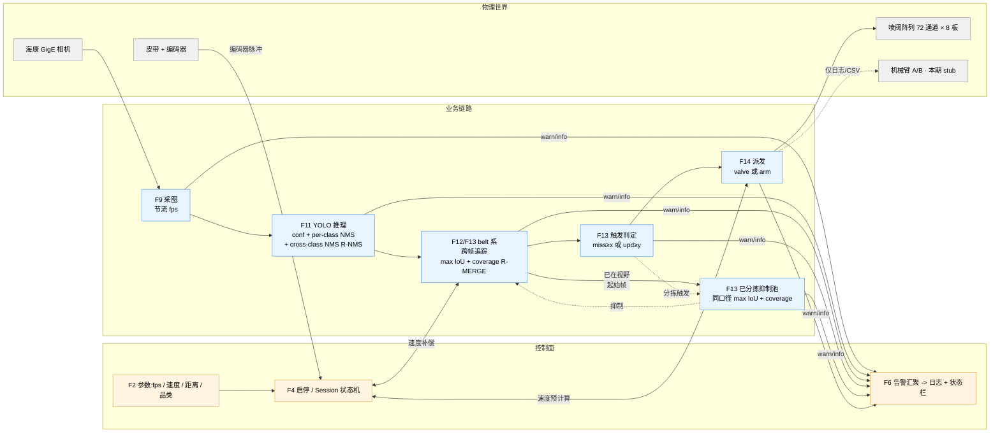

**关键业务不变量**:

- 时间戳一条线:`t_capture`(相机打戳)贯穿全链,不允许任何下游重新赋值。(需求 F9/F11)
- 位置一条线:所有几何计算都在 **belt 固定坐标系(mm)**,从采图到预计算阀序列都用 `extrapolate_y = speed × (t_now - t_capture)` 补偿位移。(需求 F12)
- 停机硬清零:一次 stop 清空 active、ghost、pending,串口不再下发。(需求 F4)

### 1.2 代码总览(线程 / 模块)

`MainWindow` 在构造函数里 `new` 出 **7 个 `QThread` 对象**(`m_cameraThread / m_yoloThread / m_trackerThread / m_dispatcherThread / m_boardThread / threadPool / threadPool_robotA`),加上进程主 GUI 线程,共 **8 个执行上下文**。其中前 5 个承载主链路 5 个 worker;后 2 个 `threadPool*` 承载 legacy 模块(`uploadpictoOSS / saveLocalpic / robotControl / tcpforrobot`),不在 `SortTask` 主链路上(详见 §6)。

跨线程协作方式:`moveToThread` + `Qt::QueuedConnection`,单生产者 / 单消费者;**没有共享可变状态需要锁**(唯一例外是 `boardControl::m_busMutex` 保护底层串口 IO)。
跨线程"调用"统一走 `QMetaObject::invokeMethod`(典型如 `sessionStart / sessionStop / preloadModel / probeConnection`),信号槽则只用于"事件回流"(典型如 `frameReadySig / detectedFrameReady / sortTaskReady / speedSample`)。

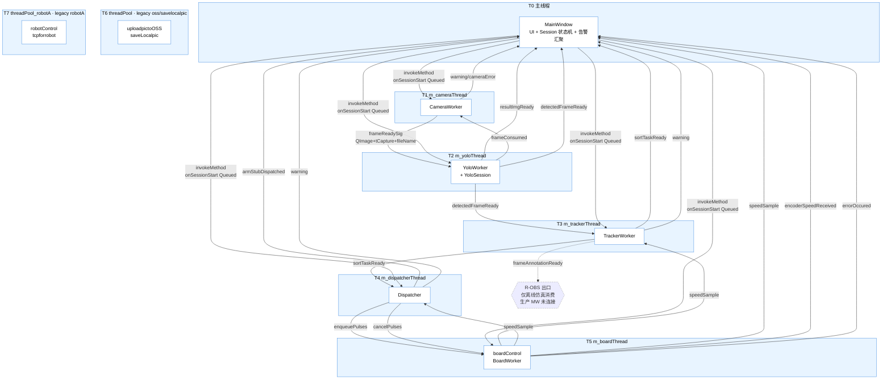

**连线规则**(`src/app/mainwindow.cpp` 构造函数里一次性建好):

- 所有跨线程 signal/slot 都是 `Qt::QueuedConnection`,参数值拷贝(已 `Q_DECLARE_METATYPE` + `qRegisterMetaType`,见 `src/app/main.cpp` L17–27)。
- `MainWindow::startSession()` 通过 `QMetaObject::invokeMethod(..., Qt::QueuedConnection)` 按 **Board → Tracker → Dispatcher → Yolo → Camera** 顺序唤起每个 worker 的 `onSessionStart`(消费者先就位、生产者最后)。
- `MainWindow::stopSession()` 同样用 `invokeMethod`,但走 `Qt::BlockingQueuedConnection`,顺序反过来 **Camera → Yolo → Tracker → Dispatcher → Board**——一个 worker 真的把队列清空(对应槽函数返回)后,主线程才进入下一个,保证 Stopping 不会与残留消息竞争。
- `probeConnection` 是少数 `Qt::BlockingQueuedConnection` 调用之一(要同步拿 bool)。
- `frameAnnotationReady` (R-OBS) 在生产 `MainWindow` 中**没有 connect**;它只在 `tests/offline_sim/main.cpp` 里被离线仿真消费,因此图中画为虚线指向 "R-OBS 出口" 占位节点,不指向 MW(避免误读为生产路径有这条副作用)。

### 1.3 目录组织

```
QINGLV/
├── guangxuan.pro              qmake 主工程
├── resources.qrc              Qt 资源清单
├── config.ini                 运行期配置(QSettings INI,UTF-8;每 key 含 ';' 行注释,详见 §4.1)
├── config.ini.example         带注释的版控模板(进 git;见 §4.1 注释保留风险)
├── src/
│   ├── app/                   MainWindow + main.cpp + .ui
│   ├── pipeline/              5 个 worker + 共享类型 + YOLO 后处理
│   ├── config/                RuntimeConfig(cfg 快照结构 + 加载器)
│   ├── infra/                 logger、时钟等基础设施
│   └── legacy/                robotcontrol / tcpforrobot / savelocalpic / uploadpictooss / updatemanager
├── resources/                 logo.png / shutdown.png
├── i18n/                      *.ts / *.qm
├── models/                    *.rknn
├── third_party/
│   ├── mvs-sdk/               海康 MVS SDK(include + lib/aarch64)
│   └── hr-robot-sdk/          HR Robot SDK
├── tools/updater/             独立子项目(QA 用升级器)
├── tests/                     QTest 单测(只依赖无 SDK 的模块)
└── docs/                      requirements / design / verification / architecture
```

---

## 2. 应用层 `src/app`

### 2.1 `MainWindow`

**定位**:UI 唯一入口,负责:

- 读 `config.ini` 组装 `RuntimeConfig` 快照 (F15)
- 构造所有 worker、绑定跨线程 signal/slot
- 管理 Session 生命周期(F4)
- 汇聚所有 worker 的 `warning` 到状态栏 + 日志(F6)

**业务逻辑图(启动到运行)**:

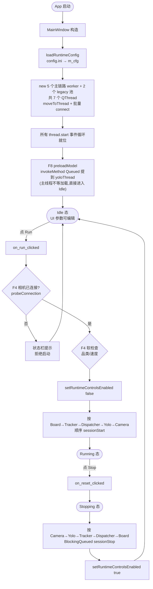

**代码逻辑图(主要方法)**:

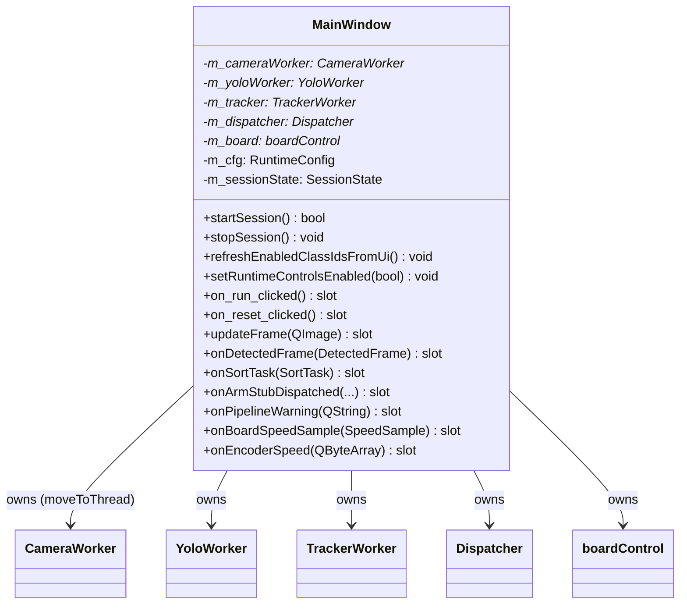

**关键实现细节**(见 `src/app/mainwindow.cpp`):

| 行为 | 入口 | 关键代码 |
|---|---|---|
| F8 模型常驻 | 构造函数最后 | `preloadModel` via `QMetaObject::invokeMethod` |
| F4 硬检查 | `startSession()` | `probeConnection` 用 `BlockingQueuedConnection` 拿 bool |
| F4 软检查 | `startSession()` | 品类为空仅告警 `statusBar()->showMessage` |
| F13 结果联动 UI | `updateFrame` / `onDetectedFrame` / `onSortTask` | 只落日志 + 更新 pixmap |
| F6 告警汇聚 | `onPipelineWarning` | 每次都 `LOG_ERROR`(日志不去重);相同文案 1 秒内**只刷状态栏一次**(`m_lastWarningMsg / m_lastWarningShownMs`),避免高频告警把状态栏刷死 |
| H1 串口错误冒泡 | 构造 `connect(m_board, errorOccured, onPipelineWarning)` | 避免 Running 下静默失败 |
| Session 状态机 | `m_sessionState: SessionState { Idle, Running, Stopping }` | 仅在主线程读写;`startSession/stopSession` 三态切换,UI 控件通过 `setRuntimeControlsEnabled` 锁闭 |
| 析构安全 | `~MainWindow` | `isRunning()` 守卫 BlockingQueued,避免死锁 |

### 2.2 Session 状态机

对应需求 F4。

**业务逻辑图**:

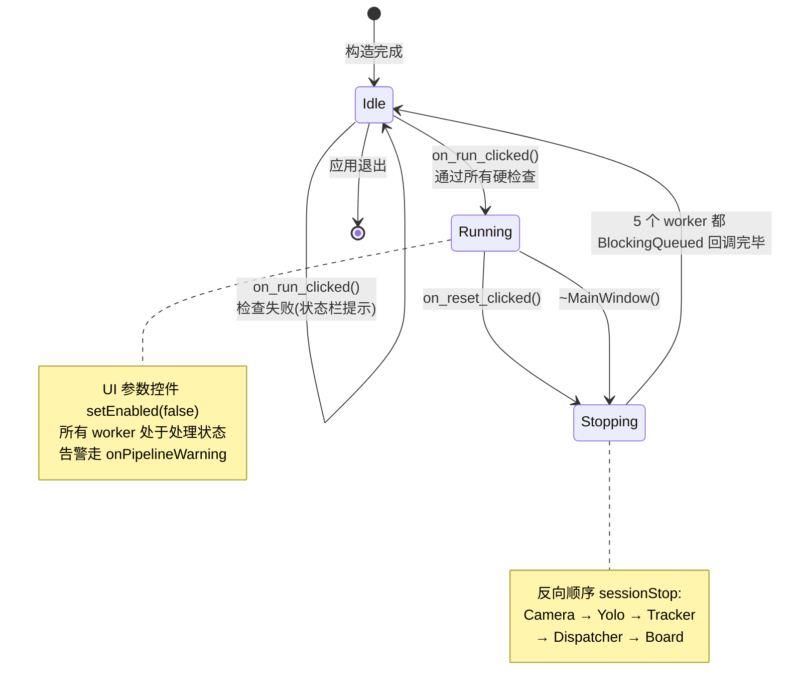

**代码逻辑图**:

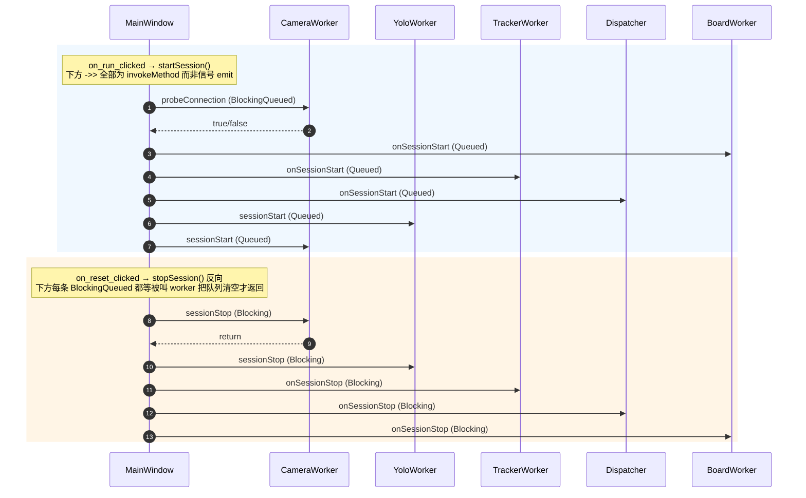

### 2.3 UI 可视化链

对应需求 F5。核心是 `YoloWorker::resultImgReady` 把已经带 overlay 的 BGR 图 `rgbSwapped().copy()` 成 QImage,发到主线程的 `MainWindow::updateFrame`,后者直接 `setPixmap`。

**业务逻辑图**:

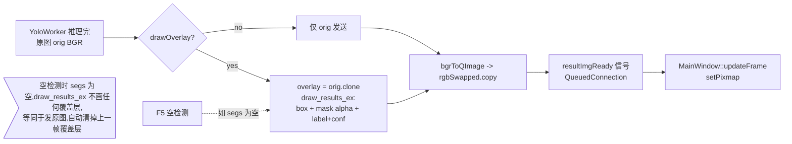

---

## 3. 流水线层 `src/pipeline`

### 3.1 `CameraWorker`

**定位**:封装海康 MVS SDK,软件节流,反压,原图落盘采样。

- 映射需求:F9、F10、F16 #1/#2。
- 文件:`src/pipeline/camera_worker.{h,cpp}`。

**业务逻辑图**:

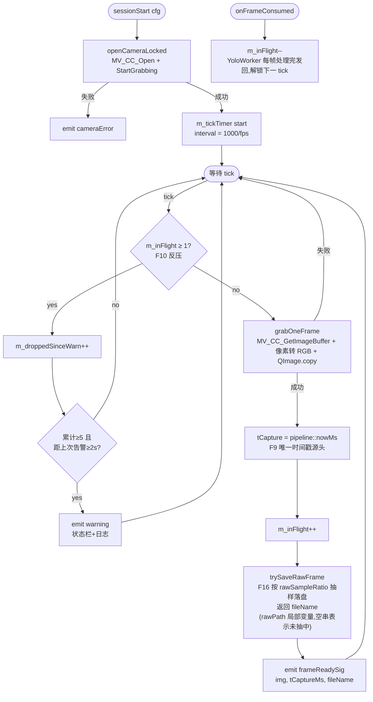

**代码逻辑图**:

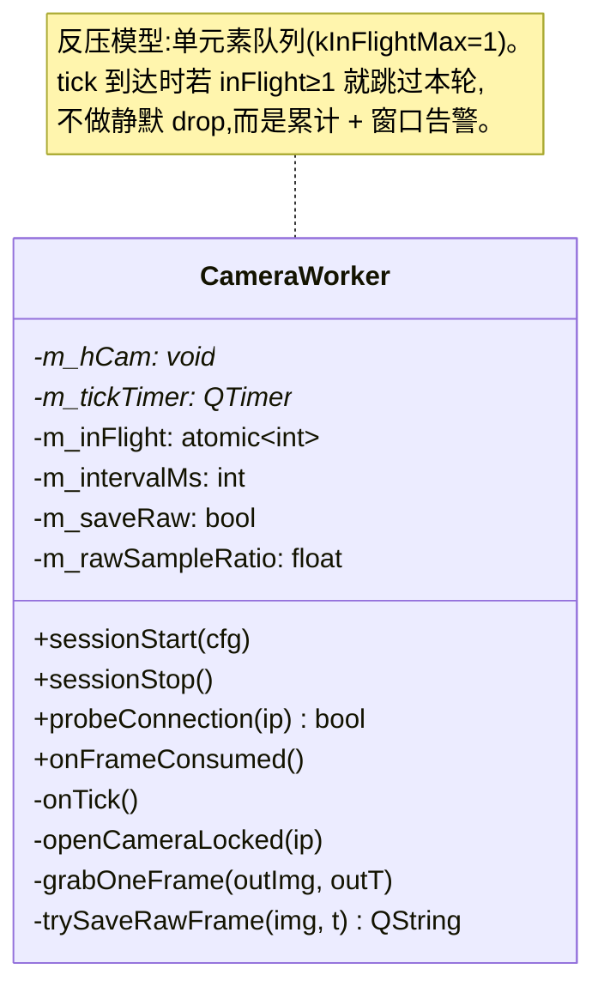

**关键字段(`RuntimeConfig`)**:`cameraIp`, `cameraHwFps`, `softFps`, `saveRaw`, `rawSampleRatio`, `saveDir`。

### 3.2 `YoloWorker` + `YoloSession` + `postprocess_ex`

**定位**:RKNN 推理 + YOLOv8-Seg 后处理 + 可视化 overlay。

- 映射需求:F8(模型常驻)、F11(过滤与字段)、F5(可视化)、F16 #3(结果图落盘)。
- 文件:
  - `src/pipeline/yolo_worker.{h,cpp}` —— Qt Worker 壳
  - `src/pipeline/yolo_session.{h,cpp}` —— RKNN C API 封装(纯 C++,无 Qt)
  - `src/pipeline/postprocess_ex.{h,cpp}` —— 置信度过滤 + 按类 NMS + Mask 计算
  - `src/pipeline/postprocess.h` —— `SegObject` 数据结构

**业务逻辑图**:

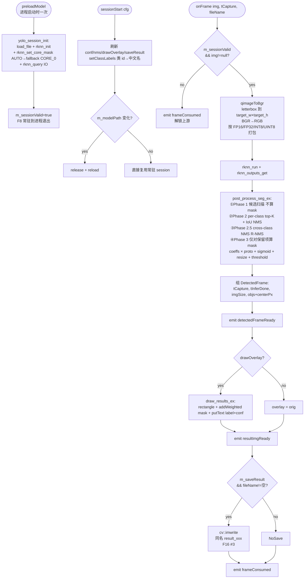

**`postprocess_ex` 三阶段优化**(`src/pipeline/postprocess_ex.cpp` 各阶段精确行号见图注):

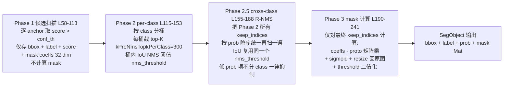

**为什么需要 Phase 2.5(R-NMS)**:垃圾分拣类别**互斥**,模型偶发同位置异类双检(实测 cls=1 conf=0.77 与 cls=5 conf=0.67 同 bbox IoU≈0.99)。per-class NMS 不抑制跨桶,会让两条都流到 Tracker → 拆出两条 track → 重复分拣。Phase 2.5 复杂度 O(N²),N<20(per-class top-K 后总数极少)实测 < 1ms 可忽略。

**为什么 mask 计算放到 Phase 3 而不是 Phase 1**:`coeffs·proto` 是 32×(160×160) 矩阵乘 + sigmoid,**单条** ≈ 0.5–1ms,数量级远高于 IoU 计算(< 1µs)。Phase 1 候选量级常 ≈ 200–500,做完两轮 NMS 后 keep 通常 < 20,只对 keep 算 mask 比"先算后筛"快 10–20 倍。代价是要在 Phase 1/2/2.5 期间用 bbox-IoU 而非 mask-IoU 做 NMS,对垃圾分拣物体形状基本是凸团块的场景影响可忽略。

**代码逻辑图**:

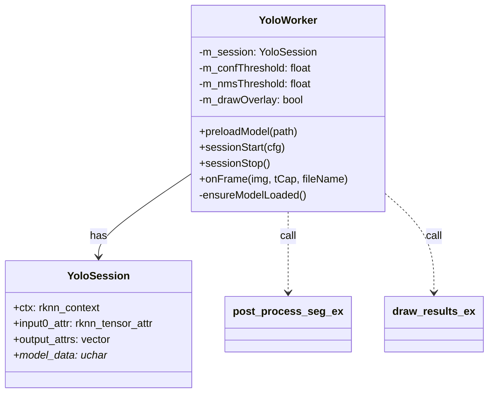

**与设计文档的差异**:

- 设计 §3.3 说"visualizeReady"信号,代码落地名为 `resultImgReady`,语义一致。
- 设计 §3.3 的 `droppedBusy` 信号未实现;反压改由 CameraWorker 内部 `m_inFlight` 计数 + 窗口告警解决(位置前移、更简单)。
- 设计 v1.0 后处理图描述为"两阶段",当前实现已扩展为"三阶段"——Phase 2 per-class NMS 之后补一道 Phase 2.5 cross-class NMS(R-NMS)。

### 3.3 `TrackerWorker`

**定位**:把逐帧检测结果转换到 belt 系,跨帧 mask-IoU 关联,触发 `SortTask`。

- 映射需求:F12、F13。
- 文件:`src/pipeline/tracker_worker.{h,cpp}`。

**业务逻辑图**:

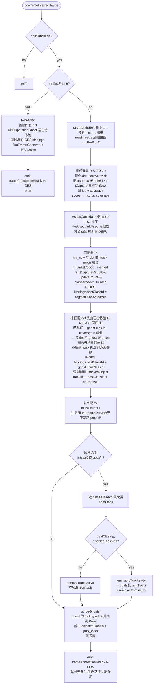

**代码逻辑图**:

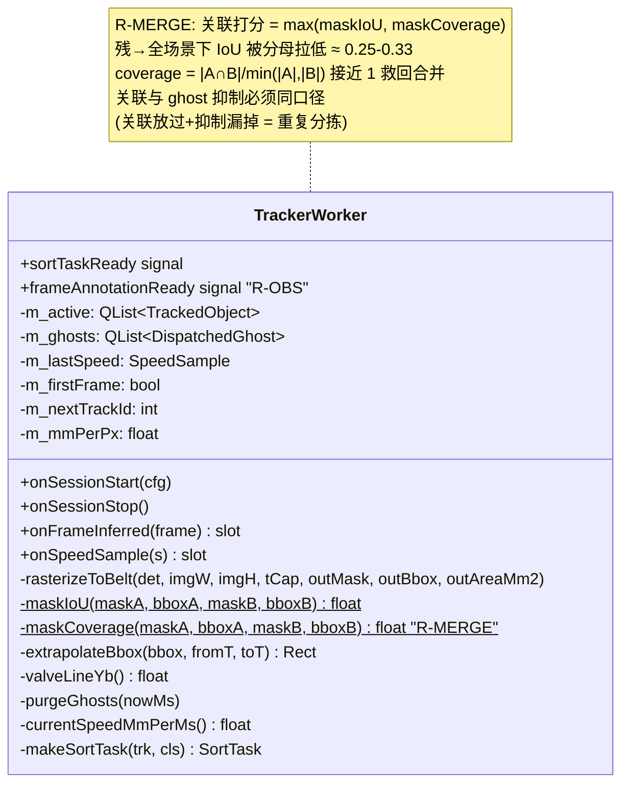

**关键算法要点**(防回归):

- `rasterizeToBelt` 只做"像素 → 相机视野内物理 mm → 栅格";**不**叠加 belt 位移。位移统一由 `extrapolateBbox` 单点加,避免"双位移"(历史 bug B1)。
- `trkUsed` 循环边界用 `trkUsed.size()` 而非 `m_active.size()`,因为未匹配 det 会先 push 到 `m_active`,尾部新 track 不能再算 miss(历史 bug B2)。
- `purgeGhosts` 里分拣线按 `sorterMode` 取 valve 或 arm;判定用 `yb_trail`(trailing edge)越过分拣线 + `dispatchedPoolClearMm`。
- **关联与抑制同口径**(R-MERGE):候选集打分 + ghost 抑制命中判定都用 `score = max(IoU, coverage)`,贪心也按 score 降序;阈值复用 `cfg.iouThreshold`。两端口径不一致会让残→全场景"关联放过 → 抑制漏掉 → 二次派发"。
- **R-OBS 帧观测信号**`frameAnnotationReady` 在主流程末尾(包括 first-frame ghost 分支)无条件 emit,`bindings` 与 `frame.objs` 一一对应、按 `detIndex` 升序;每个分支负责填好自己那一条 binding 的 `trackId / bestClassId / 三个状态位`。

### 3.4 `Dispatcher`

**定位**:把 `SortTask` 转换成 `ValvePulse` 时间轴,或 stub 到机械臂(日志 + CSV)。

- 映射需求:F14.1、F14.2、F14.2 中的速度重算。
- 文件:`src/pipeline/dispatcher.{h,cpp}`。

**业务逻辑图**:

```mermaid
flowchart TD
    ST([onSortTask task]) --> Act{sessionActive?}
    Act -- no --> Drop1
    Act -- yes --> Mode{sorterMode?}
    Mode -- Arm --> Arm[dispatchArmStub:<br/>bbox 重心→armA/B 本地 xy<br/>写 CSV + emit armStubDispatched]
    Mode -- Valve --> Compute[computePulses task, speed]
    Compute --> PulseChk{empty?}
    PulseChk -- yes --> Warn["emit warning<br/>'Dispatcher: empty pulse list<br/>for trackId=N (already past or empty mask)'<br/>语义代号 object_too_small<br/>不入 pending、不派发"]
    PulseChk -- no --> Enq[m_pending insert trackId→task<br/>emit enqueuePulses]

    SS([onSpeedSample s]) --> First{m_lastSpeed.valid?<br/>F14.2 首次基线}
    First -- no --> SaveBase[oldSpeed = s.speedMmPerMs<br/>m_lastSpeed = s<br/>delta = 0,直接 return<br/>不触发重算]
    First -- yes --> Save[oldSpeed = m_lastSpeed.speedMmPerMs<br/>m_lastSpeed = s]
    Save --> Delta{delta = abs(s - oldSpeed) / oldSpeed<br/>> speed_recalc_pct%?}
    Delta -- no --> Ret
    Delta -- yes --> Loop[遍历 m_pending 每条 task:<br/>① emit cancelPulses trackId<br/>② computePulses task, s.speedMmPerMs<br/>③ 空→drop 后从 pending 删除<br/>   非空→ emit enqueuePulses]
```

**F14.2 喷阀预计算主算法**(`computePulses`):

```mermaid
flowchart TD
    I[输入 SortTask + speed] --> G1[bbox_yb_max = y+h = 前沿<br/>bbox_yb_min = y = 后沿]
    G1 --> G2{后沿 dy_tail < 0?}
    G2 -- yes --> Rtn0[return 空<br/>已全部越过喷阀线]
    G2 -- no --> G3[t_head = tCap + dy_head/speed<br/>t_tail = tCap + dy_tail/speed]
    G3 --> G4[头部留白:<br/>从 mask 最后一行 前沿侧 向后累积<br/>直到非零像素≥totalArea × headSkipRatio]
    G4 --> G5[row_open_start → yb_open<br/>→ t_open_start]
    G5 --> Roll[滚动投影<br/>t 从 t_open_start 步长 openDurMs:<br/>① 计算 "喷阀线对应物体 mask 哪一行"<br/>② 该行非零列→xb→chanIdx→boardId/bitPos<br/>③ 构造 ValvePulse]
    Roll --> Merge[min_cmd_interval_ms 合并:<br/>同 board 上一条 pulse 距离过近<br/>→ 位图 OR、tClose 取大]
    Merge --> R[返回 QVector~ValvePulse~]
```

**代码逻辑图**:

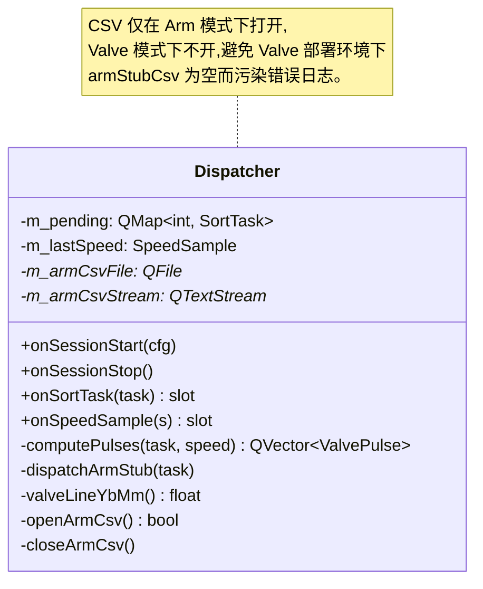

**设计边界**:

- 只发 `enqueuePulses` / `cancelPulses`,绝不自己写串口。执行节奏交给 `boardControl` 的 5 ms tick。
- 速度重算只做"整体取消 + 重算",不做 per-pulse 差分,简化 1 个数量级。

### 3.5 `boardControl`(BoardWorker)

**定位**:RS485 串口单一总线,完成两件事:

1. **500 ms 周期**问编码器 → 解析 → 发 `SpeedSample`。
2. **5 ms 周期** tick,把 `m_pending` 里 `tOpenMs ≤ now` 的 pulse 真正下发开/关阀帧。

- 映射需求:F12 速度来源、F14.2 阀控执行。
- 文件:`src/pipeline/boardcontrol.{h,cpp}`。

**业务逻辑图**:

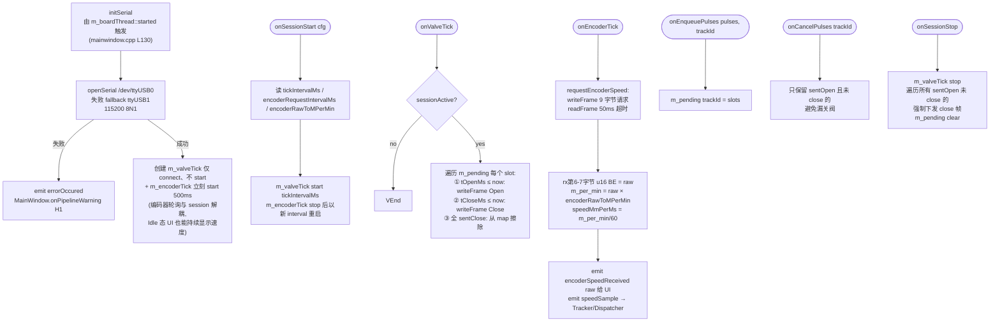

**协议(来自 `design.md §6.1`)**:

| 帧类型 | 字节布局 | 说明 |
|---|---|---|
| 批量开阀 | `AA 55 · 11 06 02 · b6(板) b7(cnt) b8(ch高) b9(ch低) · chk · 55 AA` | b7 = bit_count(b8)+bit_count(b9) |
| 批量关阀 | 同上,b7=0x09,b8=b9=0x00 | 关该板所有通道 |
| 编码器请求 | `AA 55 · 11 03 03 · 0A 21 · 55 AA` | 9 字节 |
| 编码器响应 | `AA 55 · 11 05 03 · 0A rawH rawL ...` | 11 字节 |

**代码逻辑图**:

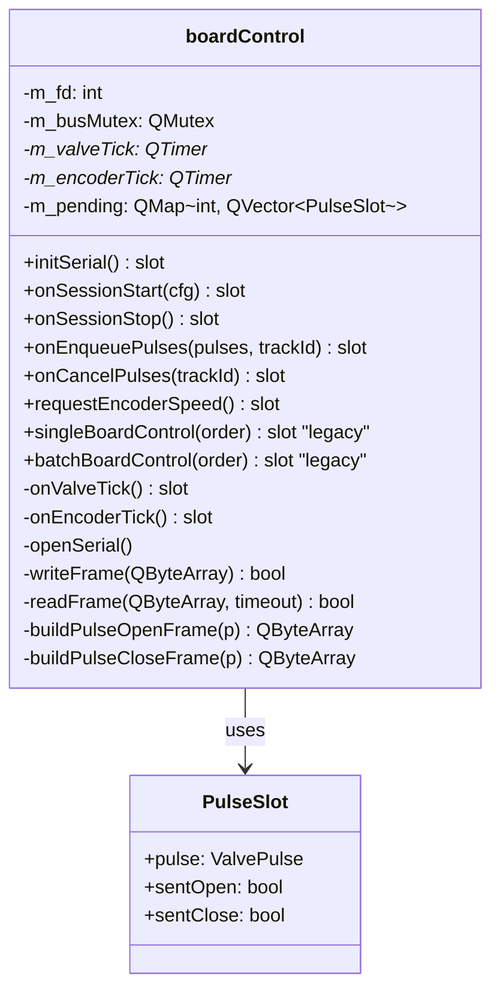

**并发 / 时序保证**:

- `m_busMutex` 仅保护 `writeFrame` 内的 write + tcdrain(单帧粒度)。
- `QTimer` 在 `m_boardThread` 的事件循环上串行触发,`onValveTick` 和 `onEncoderTick` 天然不会重入。
- `sessionStop` 先 `stop()` valveTick 再 force-close,保证 stop 后硬件不会遗留长开阀。

### 3.6 数据类型 `pipeline_types.h`

所有跨线程信号的参数 POD,`Q_DECLARE_METATYPE` + `main.cpp::qRegisterMetaType`。

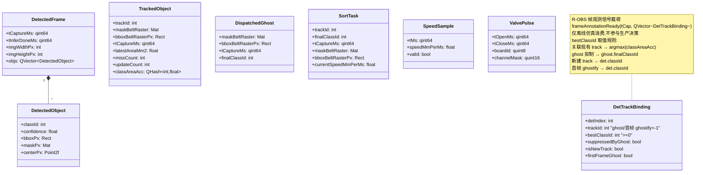

**不变量**:所有 `tCaptureMs` 字段都来自 `pipeline::nowMs()`,同一条物体全链路沿用同一个 `tCaptureMs`,禁止任何消费者重新赋值。

**`DetTrackBinding` 状态位互斥**:`suppressedByGhost / isNewTrack / firstFrameGhost` 三者最多只有一个为 `true`(关联到现有 track 时三者全 `false`,trackId ≥ 1)。

### 3.7 时钟 `pipeline_clock`

```mermaid
flowchart LR
    A[main.cpp<br/>pipeline::initClock] --> B[g_timer = QElapsedTimer<br/>g_timer.start]
    B --> C[所有 worker 取时间<br/>= pipeline::nowMs<br/>= g_timer.msecsSinceReference]
    C --> D[跨 worker 比较<br/>都基于同一起点<br/>单调递增 ms]
```

---

## 4. 配置层 `src/config`

**`RuntimeConfig`** 是一个 POD 结构(`src/config/runtime_config.h`),全字段按分组覆盖如下;`enum class SorterMode { Valve, Arm }` 是其内嵌枚举,`ClassButton { QString name; int classId; }` 是其内嵌结构。

| 分组 | 字段:类型 | 使用方 |
|---|---|---|
| camera | `cameraIp:QString`, `cameraHwFps:int`, `cameraYFlip:bool`, `realLengthMm:float`, `realWidthMm:float` | CameraWorker, TrackerWorker(物理像素映射) |
| model | `modelPath:QString`, `modelInputSize:int`, `modelTopkClassCount:int` | YoloWorker(模型加载 + 后处理) |
| yolo | `confThreshold:float`, `nmsThreshold:float`, `drawOverlay:bool`, `classButtons:QVector<ClassButton>` | YoloWorker(每次 sessionStart 刷新阈值与标签表) |
| pipeline | `softFps:int`, `iouThreshold:float`, `missFramesX:int`, `updateFramesY:int`, `dispatchedPoolClearMm:float`, `maskRasterMmPerPx:float`, `tickIntervalMs:int` | Camera/Tracker/Board |
| belt & encoder | `nominalSpeedMs:float`, `encoderRawToMPerMin:float`, `encoderRequestIntervalMs:int` | BoardWorker, Tracker/Dispatcher 兜底 |
| sorter | `sorterMode:SorterMode`, `armDistanceMm:float`, `valveDistanceMm:float` | TrackerWorker(分拣线), Dispatcher(分发分流) |
| valve | `valveTotalChannels:int`, `valveBoards:int`, `valveChannelsPerBoard:int`, `valveXMinMm:float`, `valveXMaxMm:float`, `valveHeadSkipRatio:float`, `valveOpenDurationMs:int`, `valveMinCmdIntervalMs:int`, `valveSpeedRecalcPct:int` | Dispatcher::computePulses, BoardWorker 帧组装 |
| arm_stub | `armAOriginXMm:float`, `armAOriginYMm:float`, `armAXSign:int`, `armAYSign:int`, 同 B 共 8 个 | Dispatcher::dispatchArmStub |
| persistence | `saveRaw:bool`, `rawSampleRatio:float`, `saveResult:bool`, `saveDir:QString`, `armStubCsv:QString` | CameraWorker / YoloWorker / Dispatcher |
| runtime session | `enabledClassIds:QSet<int>` (由 `MainWindow::refreshEnabledClassIdsFromUi` 从 UI 勾选合成) | TrackerWorker(触发前过滤,F3) |

**加载流程**:

```mermaid
flowchart LR
    A[MainWindow 构造] --> B[loadRuntimeConfig config.ini]
    B --> C[QSettings begin/endGroup 读各组]
    C --> D[填 RuntimeConfig 结构]
    D --> E[m_cfg 保存在 MainWindow]
    E --> F[refreshEnabledClassIdsFromUi<br/>补 enabledClassIds]
    F --> G[sessionStart Queued Q_ARG RuntimeConfig<br/>值拷贝下发到 5 个 worker]
    G --> H[worker 本地持有副本<br/>运行中不再回读文件]
```

**编码器 raw 语义**(和 master 分支口径一致):raw 是板卡内部采样好的"瞬时转速代理",直接 `raw × encoderRawToMPerMin = m/min`,**不是累计脉冲也不是窗口增量**,无需差分或除以采样窗口。数值巧合 `m/s == mm/ms`。

### 4.1 `config.ini` 全量参数对照

INI 是单一事实源,`config.ini` 中**每个 key 都已在文件中给出 ; 行注释**(含义、单位、默认值、消费方);本节给一个集中视图便于纵览。

> ⚠️ **注释保留风险(运维必读)**:`MainWindow::on_languageButton_clicked` 在切换 UI 语言时调用 `QSettings::setValue("config/language", ...) + sync()`(`mainwindow.cpp` L854–856)。Qt 的 `QSettings::IniFormat` 在写入时按"读全量 → 合并改动 → 整体写出"三步重写文件,业务上**配置的 key/value 全部仍然生效**(`QSettings` 已先把整张表读入 store,再 merge `setValue`,再整体写回),但**人为加的注释、空行、段/键顺序会被全部规范化**。
>
> 实测对比(在本仓库 `config.ini` 上跑一次 `setValue("config/language","english") + sync()`):
>
> | 维度 | 之前 | 之后 |
> |---|---|---|
> | 文件大小 | 15065 字节 | 2267 字节(缩水 85%)|
> | 总行数 | 335 | 135 |
> | `;` 注释行 | 182 | **0**(全部丢失)|
> | 业务 key/value | 全 | **全部保留**(立即再读 15/15 全对)|
> | 段顺序 | 按物理书写顺序 | 按字典序重排(`[OSS]` 跑到第 1)|
> | 段内 key 顺序 | 按物理书写顺序 | 按字典序 |
> | `\xHHHH` 转义 | 保留 | 被还原成 UTF-8 直接字符 |
>
> 结论:**配置"实"不会丢、"形"会被擦**。代码层 `loadRuntimeConfig / createButtonsFromini / loadSelectedButtonsFromIni` 完全按 key 名读取,因此 Running 业务 0 影响;但人写的注释/排版在第一次切语言后会消失。
>
> 应对:
>
> 1. 仓库根目录已存放带注释的版控模板 `config.ini.example`(与 `config.ini` 内容一致 + `;` 行注释 + 物理书写顺序)。改完 INI 字段后请**同步更新 `config.ini.example`** 进 git。
> 2. 运维改部署机参数时优先编辑模板,再 `cp config.ini.example config.ini`,而不是依赖应用内回写。
> 3. 进一步根治可考虑把 `config/language` 这种"用户偏好"剥离到独立的 `QSettings(IniFormat, UserScope, ...)` 或 `user_prefs.ini`,让 `config.ini` 退化为只读模板(代码改动,本期未做)。

按段分两类:

- **A 主链路段**(进 `RuntimeConfig`):由 `loadRuntimeConfig` 在主线程读取一次,`sessionStart` 时值拷贝下发到所有 worker,运行中不再回读文件。
- **B UI / Legacy 段**(不进 `RuntimeConfig`):由 `MainWindow` 直接 `QSettings` 读取(界面文案、品类按钮、语言、上次勾选记忆),或仅由 `legacy/uploadpictooss` 使用(OSS 凭证)。

#### A. 主链路段(`loadRuntimeConfig` 八段)

| INI key | 类型 | 默认 | 单位 | 含义 / 消费方 |
|---|---|---|---|---|
| **[camera]** | | | | |
| `ip` | string | `192.168.1.30` | — | 海康相机 IP;`CameraWorker::probeConnection` 硬连通检查 |
| `hw_fps` | int | `60` | fps | 相机硬件最大帧率;真正吐到下游的节流帧率由 `pipeline/soft_fps` 控制 |
| `y_flip` | bool | `false` | — | 图像纵向翻转(部分安装方向相反的机器);`CameraWorker` 抓帧后处理 |
| `real_length_mm` | float | `560` | mm | 视野 X 方向(列)对应物理宽度;影响 belt 系横向坐标 |
| `real_width_mm` | float | `470` | mm | 视野 Y 方向(行 = 皮带前进方向)对应物理长度;影响纵向坐标与 `extrapolateBbox` 位移补偿 |
| **[model]** | | | | |
| `path` | string | `/opt/models/yolov8seg.rknn` | 路径 | RKNN 模型路径;`YoloWorker::preloadModel` 进程启动即加载 |
| `input_size` | int | `1024` | px | letterbox 目标边长;yolov8-seg 通常 1024 或 640 |
| `topk_class_count` | int | `80` | — | 兼容 top-k 输出布局的 class 总数兜底(模型 head 元信息缺失时用) |
| `class_btn/size` | int | `0` | — | 品类按钮表项数;下方 N 项与之对齐 |
| `class_btn/N/name` | string | — | — | 第 N 项按钮 key(对应 `[categoryButtons]` 同名 key)|
| `class_btn/N/id` | int | `-1` | — | 第 N 项对应模型 class_id;`refreshEnabledClassIdsFromUi` 用 name 反查 id |
| **[yolo]** | | | | |
| `conf_threshold` | float | `0.25` | — | 置信度过滤阈值;Phase 1 候选扫描 `score < th` 直接丢 |
| `nms_threshold` | float | `0.45` | IoU | NMS IoU 阈值;Phase 2(per-class)与 Phase 2.5(cross-class)复用同一值 |
| `draw_overlay` | bool | `true` | — | 是否给 UI 发带 mask/box/label 的 overlay;关闭可省 ~5ms/帧 |
| **[pipeline]** | | | | |
| `soft_fps` | int | `2` | fps | 软节流帧率;`CameraWorker::onTick` 周期 = `1000/soft_fps` ms |
| `iou_threshold` | float | `0.30` | — | F13 关联打分阈值,口径为 `score = max(maskIoU, maskCoverage)`;ghost 抑制同口径同阈值(R-MERGE)|
| `miss_frames_x` | int | `2` | 帧 | 触发条件 A:连续 `missCount ≥ X` 视为离开视野 |
| `update_frames_y` | int | `10` | 帧 | 触发条件 B:`updateCount ≥ Y` 提前派发,避免压线遗漏 |
| `dispatched_pool_clear_distance_mm` | float | `200` | mm | ghost 池清扫距离;trailing edge 越分拣线 + 该距离才丢弃 |
| `mask_raster_mm_per_px` | float | `2.0` | mm/px | belt 系栅格 mask 分辨率;越小越精内存越大 |
| `tick_interval_ms` | int | `5` | ms | `BoardWorker::onValveTick` 周期,影响阀打开时刻精度上限 |
| **[belt]** | | | | |
| `nominal_speed_m_s` | float | `0.5` | m/s | 标称速度;首个有效 `SpeedSample` 到达前的兜底,数值上 `m/s == mm/ms` |
| `encoder_raw_to_m_per_min` | float | `0.502` | m/min/raw | 编码器 raw → 线速度系数;`speed_m_per_min = raw × 系数`,与 master 分支硬编码一致 |
| `encoder_request_interval_ms` | int | `500` | ms | 编码器请求帧周期;`onEncoderTick` 与 session 解耦,Idle 也持续轮询 |
| **[sorter]** | | | | |
| `mode` | enum | `valve` | — | `valve` → `Dispatcher::computePulses` + `enqueuePulses`;`arm` → `dispatchArmStub` 写 CSV(仅日志)|
| `arm_distance_mm` | float | `500` | mm | arm 末端距视野最近边缘的物理距离 |
| `valve_distance_mm` | float | `800` | mm | 喷阀末端距视野最近边缘的物理距离;`valveLineYb()` 与 `computePulses` 依赖 |
| **[valve]** | | | | |
| `total_channels` | int | `72` | — | 通道总数 = `boards × channels_per_board` |
| `boards` | int | `8` | — | RS485 总线上控制板数 |
| `channels_per_board` | int | `9` | — | 每块板通道数 |
| `x_min_mm`, `x_max_mm` | float | `0`, `560` | mm | 阵列横向物理覆盖范围;通道 i 对应的 belt-x 区间 = `[xmin+i·step, xmin+(i+1)·step]`,`step = (xmax-xmin)/total_channels` |
| `head_skip_ratio` | float | `0.125` | [0,1] | 头部留白比例;累积非零像素 ≥ `totalArea × ratio` 才开始投影,避免薄前沿瞬开瞬关 |
| `open_duration_ms` | int | `50` | ms | 单条 `ValvePulse` 开启时长 = 滚动投影步长 |
| `min_cmd_interval_ms` | int | `50` | ms | 同板上下两条 pulse 最小命令间隔;距离过近则位图 OR 合并、`tClose` 取大 |
| `speed_recalc_threshold_pct` | int | `20` | % | 速度突变重算阈值;`abs(Δ)/old > pct%` 才触发 cancel + recompute + enqueue |
| **[arm_stub]** | | | | |
| `a_origin_x_mm` / `a_origin_y_mm` | float | `0` | mm | armA 原点;`armA.xy = a_*_sign × (bbox_xy - a_origin_*)` |
| `a_x_sign` / `a_y_sign` | int | `1` | ±1 | armA 轴极性 |
| `b_origin_x_mm` / `b_origin_y_mm` | float | `0` | mm | armB 原点 |
| `b_x_sign` / `b_y_sign` | int | `1` | ±1 | armB 轴极性 |
| **[persistence]** | | | | |
| `save_raw` | bool | `false` | — | 是否抽样保存原始相机帧到 `save_dir`(F16 #1)|
| `raw_sample_ratio` | float | `0.1` | [0,1] | 原始帧抽样比例 |
| `save_result` | bool | `false` | — | 是否保存 YOLO 后处理后的 `result_*.jpg`(F16 #3)|
| `save_dir` | string | `/data/captures` | 路径 | 落盘根目录;路径不存在时按需 mkdir -p |
| `arm_stub_csv` | string | `/data/logs/arm_stub.csv` | 路径 | arm 模式下派发 CSV 的输出路径(valve 模式不打开此文件)|

#### B. UI / Legacy 段(不进 `RuntimeConfig`)

| 段 / key | 读取方 | 用途 |
|---|---|---|
| `[colorButtons]` 全键 | `MainWindow::createButtonsFromini("colorButtons", ...)` | F3 颜色按钮显示文案;中文用 `\xHHHH` 转义,英文走 `i18n/*.qm` |
| `[categoryButtons]` 全键 | `createButtonsFromini("categoryButtons", ...)` | F3 主品类按钮文案;**与 `[model] class_btn/N/name` 一一对应**,是 name → class_id 反查的入口 |
| `[labelButtons]` 全键 | `createButtonsFromini("labelButtons", ...)` | F3 标签类型按钮文案 |
| `[shapeButtons]` 全键 | `createButtonsFromini("shapeButtons", ...)` | F3 外形按钮文案 |
| `[appearanceButtons]` 全键 | `createButtonsFromini("appearanceButtons", ...)` | F3 外观状态按钮文案 |
| `[SelectedButtons] / names` | `MainWindow::startSession()` 内 `QSettings` 直读 | UI 上次勾选记忆(逗号分隔的按钮 key 列表);进 `RuntimeConfig::enabledClassIds`,F13 触发前过滤 |
| `[OSS] / endpoint` 等 4 项 | `legacy/uploadpictooss.cpp` 直读 | 阿里云 OSS 凭证;**主链路不依赖**,缺失/错误不影响 Running 业务。⚠ 真实部署不要把私钥提交进库 |
| `[config] / language` | `MainWindow` 构造 + `on_languageButton_clicked` 写回 | UI 语言:`chinese` \| `english`;切换时持久化 |

#### 修改 / 新增 INI 字段的 SOP

1. **`runtime_config.h`** 加字段 + 默认值。
2. **`runtime_config.cpp::loadRuntimeConfig`** 在对应 `beginGroup/endGroup` 区段里 `s.value(...).toX()` 读取(用 `cfg.field` 当默认,保证 INI 缺失时回落)。
3. **`config.ini`** 与 **`config.ini.example`** 同步添加 key,**上一行加 `; 含义/单位/默认/消费方` 注释**。
4. **`docs/architecture.md` §4.1**(本表)添加一行;若该字段进入需求/设计层,同步更新 `requirements.md` / `design.md`。
5. **测试**:`tests/test_runtime_config.cpp` 补一条 `loadRuntimeConfig_*` 用例覆盖新 key 的解析与默认回落。

---

## 5. 基础设施 `src/infra`

- `logger.{h,cpp}`:轻量日志宏 `LOG_INFO / LOG_ERROR`,底层同步写文件 + stderr。所有 worker 共用。
- `pipeline_clock.{h,cpp}`:全局 `QElapsedTimer`,单调时钟源;`initClock()` 在 `main.cpp` 最早调用一次。

```mermaid
flowchart LR
    main --> initClock --> pipeline::nowMs
    subgraph 全量调用者
        CW -.-> pipeline::nowMs
        YW -.-> pipeline::nowMs
        TW -.-> pipeline::nowMs
        DP -.-> pipeline::nowMs
        BW -.-> pipeline::nowMs
    end
```

---

## 6. 遗留模块 `src/legacy`

以下代码当前保留不在主链路,留给后续阶段。`MainWindow` 仍 `new` 出实例并 `moveToThread`,但**它们没有任何信号槽连到 `SortTask` 主链路**(grep `m_robot / ossThread / savelocalpicThread / m_tcpserverA` 即可确认),Running 态行为不依赖它们。

| 文件 | 作用 | 线程归属 | 状态 |
|---|---|---|---|
| `uploadpictooss.{h,cpp}` | 阿里云 OSS 上传 | `threadPool`(T6) | 保留,不纳入关键路径 |
| `savelocalpic.{h,cpp}` | 旧本地保存逻辑 | `threadPool`(T6) | 由 `CameraWorker::trySaveRawFrame` + `YoloWorker` 落盘取代 |
| `robotcontrol.{h,cpp}` | HR Robot SDK 调用壳 | `threadPool_robotA`(T7) | 仅为未来对接 stub 保留 |
| `tcpforrobot.{h,cpp}` | TCP server,原本给机械臂 | `threadPool_robotA`(T7) | 保留,不在 SortTask 链路 |
| `updatemanager.{h,cpp}` | 更新检查 | 主 GUI 线程(`on_checkforNew_clicked` 中临时 `new`) | 用户主动点"检查更新"才生效 |

---

## 7. 端到端时序(典型一帧)

把一颗物体从"进入视野"到"喷阀打中"画成一张图。假设:

- fps=2,tickIntervalMs=5,openDurationMs=50
- 相机视野纵向 realWidthMm=470mm
- 喷阀距视野最近边缘 valveDistanceMm=800mm
- 皮带速度 0.5 m/s = 0.5 mm/ms

```mermaid
sequenceDiagram
    autonumber
    participant HW as 皮带/相机/阀
    participant CW as CameraWorker
    participant YW as YoloWorker
    participant TW as TrackerWorker
    participant DP as Dispatcher
    participant BW as BoardWorker

    rect rgb(230,245,255)
    Note over HW,BW: 阶段 A:采图 + 推理(~200ms/帧)
    HW->>CW: MV_CC_GetImageBuffer (frame)
    CW->>CW: t_capture = pipeline::nowMs
    CW->>CW: 抽样落盘 raw (F16)
    CW->>YW: frameReadySig(img, t_capture, file)
    YW->>YW: letterbox + rknn_run + post_process_seg_ex
    YW->>YW: overlay 绘制
    YW->>TW: detectedFrameReady (DetectedFrame)
    YW->>CW: frameConsumed (解锁反压)
    end

    rect rgb(255,245,225)
    Note over TW: 阶段 B:跨帧追踪 (~1ms)
    TW->>TW: rasterizeToBelt (每个 det 转栅格,只做像素→mm,不叠位移)
    TW->>TW: 候选集打分 score = max(maskIoU, maskCoverage) (R-MERGE)
    TW->>TW: extrapolateBbox 所有 active 到 tNow,贪心按 score 降序匹配
    TW->>TW: 未匹配 det 同口径查 ghost 池 → 命中则 union 融合,不新建 track
    alt miss≥X 或 upd≥Y 且 bestClass ∈ enabledClassIds
        TW->>DP: sortTaskReady (SortTask)
        TW->>TW: 把 trk 转 ghost push 到 m_ghosts
    end
    TW->>TW: purgeGhosts (trailing edge 越过分拣线 + pool_clear)
    TW->>TW: emit frameAnnotationReady (R-OBS,生产路径无副作用)
    end

    rect rgb(240,255,230)
    Note over DP,BW: 阶段 C:阀序列预计算(~1ms)
    DP->>DP: computePulses(task, speed)
    Note right of DP: 算 t_head/t_tail<br/>+ 头部留白 row_open_start<br/>+ 滚动投影按 openDurMs 步进<br/>+ min_cmd_interval_ms 合并
    DP->>BW: enqueuePulses(QVector<ValvePulse>, trackId)
    BW->>BW: m_pending[trackId] = slots
    end

    rect rgb(255,235,235)
    Note over BW,HW: 阶段 D:阀硬件执行(每 5ms tick)
    loop 每 5ms onValveTick
        BW->>BW: for slot: tOpenMs ≤ now → writeFrame Open
        BW->>HW: AA 55 11 06 02 ... 55 AA (开)
        BW->>BW: tCloseMs ≤ now → writeFrame Close
        BW->>HW: AA 55 11 06 02 ... b7=0x09 ... 55 AA (关)
    end
    end

    rect rgb(245,240,255)
    Note over BW,TW: 阶段 E:速度监测 + 重算(每 500ms)
    BW->>HW: writeFrame 请求帧 (9 字节)
    HW-->>BW: 响应帧 (11 字节)
    BW->>TW: speedSample (Qt Queued)
    BW->>DP: speedSample
    alt |Δspeed|/old > speed_recalc_pct
        DP->>BW: cancelPulses(trackId)
        DP->>DP: recompute pulses with new speed
        DP->>BW: enqueuePulses(new pulses)
    end
    end
```

---

## 8. 需求-设计-代码对照表

| 需求编号 | 需求点 | 设计章节 | 代码落地 |
|---|---|---|---|
| F1 | 分拣器选择(valve/arm) | §1 模块图 + §3.6 | `RuntimeConfig::sorterMode`;`Dispatcher::onSortTask` 按 mode 分流 |
| F2 | 皮带速度/fps/距离配置 | §5 配置 schema | `RuntimeConfig` 各字段;`config.ini` [pipeline][sorter] |
| F3 | 品类按钮 → `enabledClassIds` | §5 | `MainWindow::refreshEnabledClassIdsFromUi`;`TrackerWorker` 过滤 |
| F4 | 启停、第一帧丢弃、硬停 | §1.3 Session | `startSession/stopSession`;`TrackerWorker::m_firstFrame` |
| F5 | 可视化 box+mask+label,空检测清屏 | §3.3 | `YoloWorker::resultImgReady` + `draw_results_ex` |
| F6 | 告警同时进日志 + 状态栏 | §7.1 | `MainWindow::onPipelineWarning` 汇聚 |
| F8 | 模型常驻 | §3.3 | `YoloWorker::preloadModel` / `ensureModelLoaded` |
| F9 | 采图 + 节流 + t_capture | §3.2 | `CameraWorker::onTick` + `pipeline::nowMs` |
| F10 | 单元素反压 + 告警 | §3.2 | `CameraWorker::m_inFlight` + 窗口告警 |
| F11 | conf/nms 参数化 + 每目标字段 | §3.3 + §4 | `post_process_seg_ex` Phase 1+2 + `DetectedFrame/DetectedObject` |
| F11(R-NMS) | 互斥分类 cross-class NMS | design §5.6 | `post_process_seg_ex` Phase 2.5(`postprocess_ex.cpp` L155-188)|
| F12 | 像素→belt 系,`t_now - t_capture` 补偿 | §4.1 | `TrackerWorker::rasterizeToBelt` + `extrapolateBbox` |
| F13 | 跨帧追踪、贪心、抑制池 | §4.3 | `TrackerWorker::onFrameInferred` |
| F13(R-MERGE) | 关联打分 `max(IoU, coverage)`,关联与抑制同口径 | design §5.2 | `TrackerWorker::maskCoverage` + `onFrameInferred` 第 2/4 步 |
| F13.1(R-OBS) | Tracker 帧观测信号(离线仿真用) | design §4.9 | `TrackerWorker::frameAnnotationReady` + `DetTrackBinding`(`pipeline_types.h`)|
| F14.1 | Arm stub 日志 + CSV | §4.5 + §7.2 | `Dispatcher::dispatchArmStub` + arm_stub.csv |
| F14.2 | 阀预计算 + 速度重算 | §4.4 | `Dispatcher::computePulses` + `onSpeedSample` |
| F15 | 统一 `config.ini` | §5 | `loadRuntimeConfig` + `RuntimeConfig` |
| F16 | 保存原图/结果图 | §3.2 + §3.3 | `CameraWorker::trySaveRawFrame` + `YoloWorker::onFrame` 落盘 |

---

## 文档状态

- **版本**:v1.2
- **对齐**:`requirements.md` v2.1 + `design.md` v2.1 + 当前 `src/` 实现(R1/R2/R4 三处主逻辑改动已合并到 `refactor/phase5-pipeline`)
- **变更历史**:
  - **v1.1 → v1.2**(本次"严谨化"通读对齐):
    - **新增 §4.1 `config.ini` 全量参数对照**:把 `loadRuntimeConfig` 八个主链路段(camera/model/yolo/pipeline/belt/sorter/valve/arm_stub/persistence)与 8 个 UI/Legacy 段(colorButtons/categoryButtons/labelButtons/shapeButtons/appearanceButtons/SelectedButtons/OSS/config)的所有 INI key 列成两张总表,标注类型/默认/单位/消费方;并写出"修改/新增 INI 字段"的 SOP。
    - **`config.ini` 全量加注释**:每段加段头注释说明加载方与用途;每个算法相关 key 上一行加 `;` 注释含义/单位/默认/消费方(`y_flip / hw_fps / iou_threshold / encoder_raw_to_m_per_min / valve_distance_mm / head_skip_ratio / speed_recalc_threshold_pct` 等全部覆盖);UI 按钮组段头说明文案与 `[categoryButtons] ↔ [model]/class_btn/N/name` 的 1-1 对应关系。注释一律放在 key 上一行,不写行内,避免与 `\xHHHH` 转义共行的解析歧义。
    - **新增 `config.ini.example`**:与 `config.ini` 同步的带注释版控模板,用于规避 `QSettings::setValue + sync()` 重写文件时 `;` 注释会被擦除的风险(`mainwindow.cpp` L854–856 切语言时会触发);§4.1 顶部加 ⚠️ 警告框 + SOP 说明该模板的维护方式。
    - §1.2 文字"7 个 Qt 线程"改为"7 个 `QThread` 对象 + 主 GUI 线程 = 8 个执行上下文",并枚举出全部线程成员变量;补"跨线程调用走 `invokeMethod`、信号槽只用于事件回流"的边界说明。
    - §1.2 总览图把原来 `T6 threadPool/robotA` **拆成 T6 / T7 两个 subgraph**(threadPool 装 OSS+savelocalpic;threadPool_robotA 装 robot+tcp),与代码 `moveToThread` 实际归属完全一致。
    - §1.2 总览图原来的 `TW -. frameAnnotationReady --> MW` 边修正为 `TW -.-> OBS{{R-OBS 出口}}`,与"生产 `MainWindow` 没有 connect 该信号、只有离线仿真层消费"的代码事实一致;并在"连线规则"段加一条说明。
    - §1.2 "连线规则"段补 startSession/stopSession 顺序与 BlockingQueued 语义。
    - §2.1 关键实现细节表 F6 行明确"日志不去重 + 状态栏 1 秒去重",新增"Session 状态机"行写出 `enum class SessionState { Idle, Running, Stopping }`。
    - §2.2 sequence diagram 两个 Note 加注"->> 全部为 `invokeMethod` 而非信号 emit",避免误解为 emit 信号。
    - §3.1 `CameraWorker` 业务图 `frameReadySig` 第三参统一改为 `fileName`(对齐 `camera_worker.h` 信号声明),并标注"`rawPath` 是其局部变量、空串=未抽中"。
    - §3.2 后处理三阶段图节点写出 `postprocess_ex.cpp` 各阶段精确行号(L58-113 / L115-153 / L155-188 / L190-241)与常量名 `kPreNmsTopkPerClass=300`;新增"为什么 mask 计算放到 Phase 3"段(说明把 mask 计算延后到只对 keep 算的优化收益)。
    - §3.4 `Dispatcher` 业务图为 `onSpeedSample` **加首次有效速度作基线、不触发重算**的判定分支(代码:`oldSpeed = m_lastSpeed.valid ? m_lastSpeed.speedMmPerMs : s.speedMmPerMs`);`computePulses` 返回空时的告警节点写出实际文案(`Dispatcher: empty pulse list ...`)与语义代号(`object_too_small`);delta 公式精确化。
    - §3.5 `boardControl` 业务图入口 Init 节点注解 "由 `m_boardThread::started` 触发(`mainwindow.cpp` L130)";Timers 节点说明编码器轮询与 session 解耦(Idle 态也持续刷速度)。
    - §4 `RuntimeConfig` 字段表改为"全字段 + 类型"列法:补 `cameraYFlip / modelTopkClassCount`,标注 `enabledClassIds: QSet<int>`、`sorterMode: SorterMode` 内嵌 enum、`classButtons: QVector<ClassButton>` 内嵌 struct。
    - §6 legacy 表加"线程归属"列(threadPool / threadPool_robotA / 主 GUI 线程),正文明确"它们没有任何信号槽连到 SortTask 主链路"。
    - §7 端到端时序阶段 B 改写为 R-MERGE 口径:打分 `score = max(maskIoU, maskCoverage)`、未匹配 det 同口径查 ghost 池、末尾补 `frameAnnotationReady` 一行。
    - §8 对照表 F11(R-NMS) 行号修正为 `L155-188`。

  - **v1.0 → v1.1**:
    - §1.1 业务总览 Mermaid 节点 S2/S3/S5 标注新口径(per-class + cross-class NMS、max IoU + coverage、ghost 抑制同口径)。
    - §1.2 代码总览新增 `TrackerWorker --frameAnnotationReady--> MainWindow`(虚线,标注"R-OBS 仅离线仿真消费")。
    - §3.2 业务图把 `post_process_seg_ex` 由"两阶段"改为"四子步"(Phase 1/2/2.5/3);专题图重画为三阶段优化版,显式画 Phase 2.5 节点;新增"为什么需要 Phase 2.5 (R-NMS)"段落。
    - §3.2 末"与设计文档的差异"补一条:后处理已从两阶段扩展为三阶段。
    - §3.3 业务图里关联打分改成 `max(IoU, coverage)`、ghost 抑制改成同口径;首帧 ghostify / 主流程末尾各加一条 `frameAnnotationReady` emit;每个分支节点显式标注 `bestClassId` 来源;类图加 `maskCoverage / frameAnnotationReady` 字段 + 一条 R-MERGE 注释;关键算法要点新增"关联与抑制同口径"和"R-OBS 帧观测信号"两条。
    - §3.6 数据类型类图新增 `DetTrackBinding` 类 + 取值规则注释,正文新增"`DetTrackBinding` 状态位互斥"不变量。
    - §8 需求-代码对照表新增 3 行:F11(R-NMS)、F13(R-MERGE)、F13.1(R-OBS),并把 F11 原行口径改为"Phase 1+2"。
  - **v1.0**:第一版,与代码同步时间点为结构重组 commit `7e04ca8` 之后。
