# 光选分拣系统架构详解 v1.0

> 本文件把 `docs/requirements.md` v1.1 的产品需求、`docs/design.md` v1.0 的技术方案
> 和当前仓库实际落地的代码三者**一起**对齐,按"总-分"树形组织,每个主要节点都提供:
>
> 1. **业务逻辑图**(Business flow)—— 描述"做什么 / 在什么约束下做"。
> 2. **代码逻辑图**(Code flow)—— 描述"怎么做 / 谁调谁"。
>
> 所有图用 Mermaid;以下所有 `src/xxx` 路径都是仓库内真实文件。

---

## 目录

- [1. 系统总览](#1-系统总览)
  - [1.1 业务总览](#11-业务总览)
  - [1.2 代码总览(线程 / 模块)](#12-代码总览线程--模块)
  - [1.3 目录组织](#13-目录组织)
- [2. 应用层 `src/app`](#2-应用层-srcapp)
  - [2.1 `MainWindow`](#21-mainwindow)
  - [2.2 Session 状态机](#22-session-状态机)
  - [2.3 UI 可视化链](#23-ui-可视化链)
- [3. 流水线层 `src/pipeline`](#3-流水线层-srcpipeline)
  - [3.1 `CameraWorker`](#31-cameraworker)
  - [3.2 `YoloWorker` + `YoloSession` + `postprocess_ex`](#32-yoloworker--yolosession--postprocess_ex)
  - [3.3 `TrackerWorker`](#33-trackerworker)
  - [3.4 `Dispatcher`](#34-dispatcher)
  - [3.5 `boardControl`(BoardWorker)](#35-boardcontrolboardworker)
  - [3.6 数据类型 `pipeline_types.h`](#36-数据类型-pipeline_typesh)
  - [3.7 时钟 `pipeline_clock`](#37-时钟-pipeline_clock)
- [4. 配置层 `src/config`](#4-配置层-srcconfig)
- [5. 基础设施 `src/infra`](#5-基础设施-srcinfra)
- [6. 遗留模块 `src/legacy`](#6-遗留模块-srclegacy)
- [7. 端到端时序(典型一帧)](#7-端到端时序典型一帧)
- [8. 需求-设计-代码对照表](#8-需求-设计-代码对照表)

---

## 1. 系统总览

### 1.1 业务总览

把任务分成"采图 → 识别 → 追踪 → 派发 → 执行"5 个环节,横向贯穿"编码器实时速度"和"任务生命周期"两条支线。

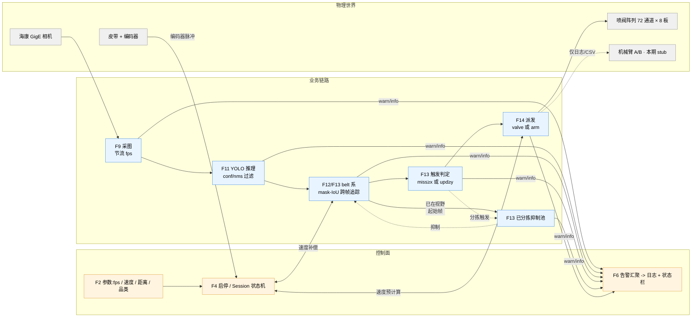

**关键业务不变量**:

- 时间戳一条线:`t_capture`(相机打戳)贯穿全链,不允许任何下游重新赋值。(需求 F9/F11)
- 位置一条线:所有几何计算都在 **belt 固定坐标系(mm)**,从采图到预计算阀序列都用 `extrapolate_y = speed × (t_now - t_capture)` 补偿位移。(需求 F12)
- 停机硬清零:一次 stop 清空 active、ghost、pending,串口不再下发。(需求 F4)

### 1.2 代码总览(线程 / 模块)

7 个 Qt 线程,全部 `moveToThread` + `Qt::QueuedConnection` 协作,单生产者 / 单消费者,**没有共享可变状态需要锁**(唯一例外是 `boardControl::m_busMutex` 保护底层串口 IO)。

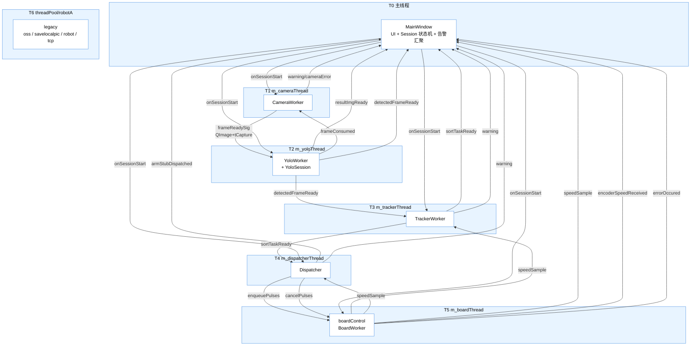

**连线规则**(`src/app/mainwindow.cpp` 构造函数里一次性建好):

- 所有跨线程 signal/slot 都是 `Qt::QueuedConnection`,参数值拷贝。
- `probeConnection` 是少数 `Qt::BlockingQueuedConnection` 调用之一(要同步拿 bool)。
- `stopSession` 用 `Qt::BlockingQueuedConnection` 保证 worker 真的清完队列才放行。

### 1.3 目录组织

```
QINGLV/
├── guangxuan.pro              qmake 主工程
├── resources.qrc              Qt 资源清单
├── config.ini                 运行期配置(QSettings INI)
├── src/
│   ├── app/                   MainWindow + main.cpp + .ui
│   ├── pipeline/              5 个 worker + 共享类型 + YOLO 后处理
│   ├── config/                RuntimeConfig(cfg 快照结构 + 加载器)
│   ├── infra/                 logger、时钟等基础设施
│   └── legacy/                robotcontrol / tcpforrobot / savelocalpic / uploadpictooss / updatemanager
├── resources/                 logo.png / shutdown.png
├── i18n/                      *.ts / *.qm
├── models/                    *.rknn
├── third_party/
│   ├── mvs-sdk/               海康 MVS SDK(include + lib/aarch64)
│   └── hr-robot-sdk/          HR Robot SDK
├── tools/updater/             独立子项目(QA 用升级器)
├── tests/                     QTest 单测(只依赖无 SDK 的模块)
└── docs/                      requirements / design / verification / architecture
```

---

## 2. 应用层 `src/app`

### 2.1 `MainWindow`

**定位**:UI 唯一入口,负责:

- 读 `config.ini` 组装 `RuntimeConfig` 快照 (F15)
- 构造所有 worker、绑定跨线程 signal/slot
- 管理 Session 生命周期(F4)
- 汇聚所有 worker 的 `warning` 到状态栏 + 日志(F6)

**业务逻辑图(启动到运行)**:

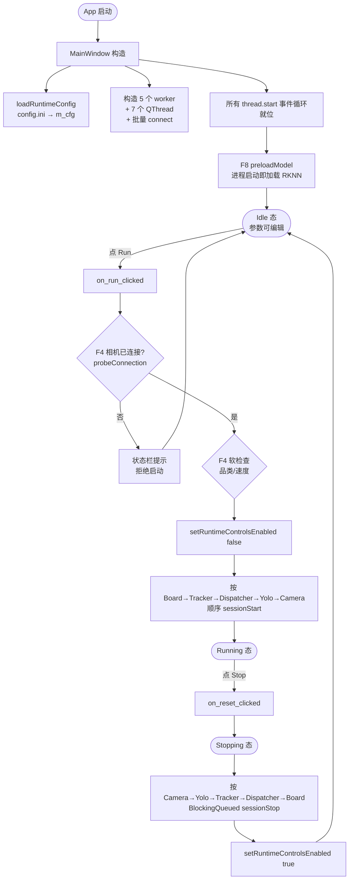

**代码逻辑图(主要方法)**:

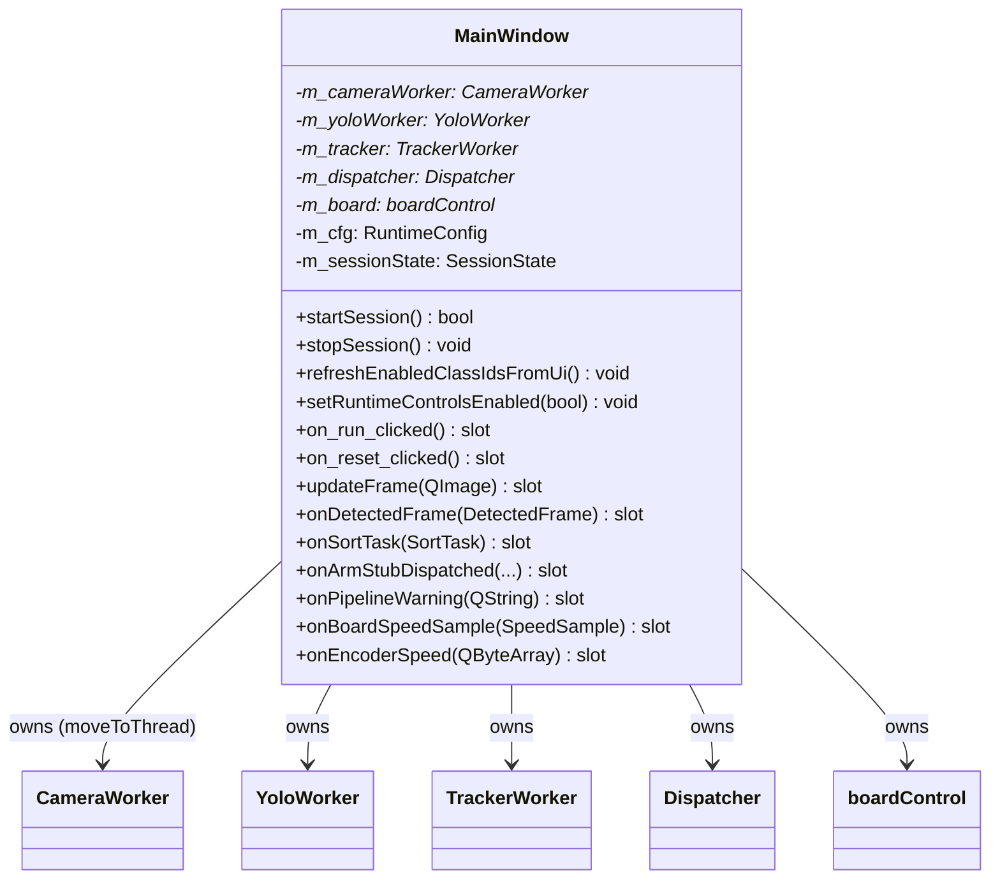

**关键实现细节**(见 `src/app/mainwindow.cpp`):

| 行为 | 入口 | 关键代码 |
|---|---|---|
| F8 模型常驻 | 构造函数最后 | `preloadModel` via `QMetaObject::invokeMethod` |
| F4 硬检查 | `startSession()` | `probeConnection` 用 `BlockingQueuedConnection` 拿 bool |
| F4 软检查 | `startSession()` | 品类为空仅告警 `statusBar()->showMessage` |
| F13 结果联动 UI | `updateFrame` / `onDetectedFrame` / `onSortTask` | 只落日志 + 更新 pixmap |
| F6 告警汇聚 | `onPipelineWarning` | `LOG_ERROR` + `statusBar()->showMessage(..., 5000)` |
| H1 串口错误冒泡 | 构造 `connect(m_board, errorOccured, onPipelineWarning)` | 避免 Running 下静默失败 |
| 析构安全 | `~MainWindow` | `isRunning()` 守卫 BlockingQueued,避免死锁 |

### 2.2 Session 状态机

对应需求 F4。

**业务逻辑图**:

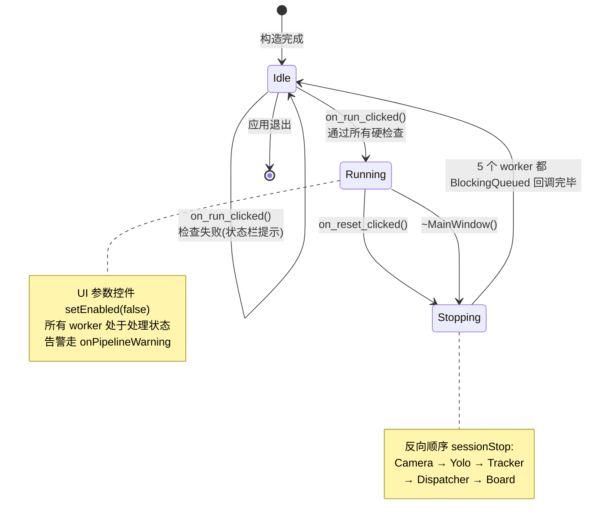

**代码逻辑图**:

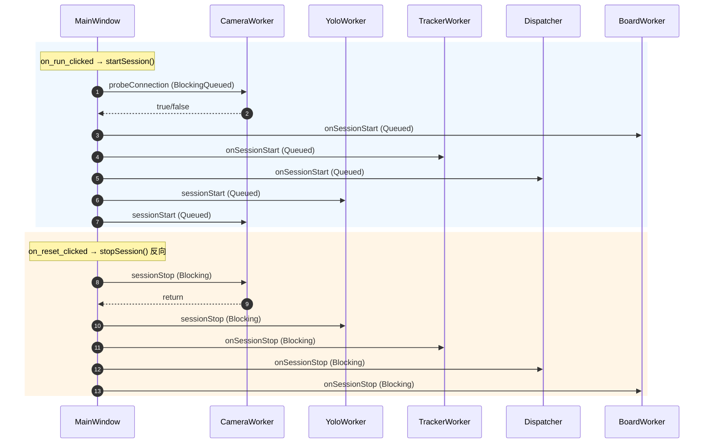

### 2.3 UI 可视化链

对应需求 F5。核心是 `YoloWorker::resultImgReady` 把已经带 overlay 的 BGR 图 `rgbSwapped().copy()` 成 QImage,发到主线程的 `MainWindow::updateFrame`,后者直接 `setPixmap`。

**业务逻辑图**:


---

## 3. 流水线层 `src/pipeline`

### 3.1 `CameraWorker`

**定位**:封装海康 MVS SDK,软件节流,反压,原图落盘采样。

- 映射需求:F9、F10、F16 #1/#2。
- 文件:`src/pipeline/camera_worker.{h,cpp}`。

**业务逻辑图**:

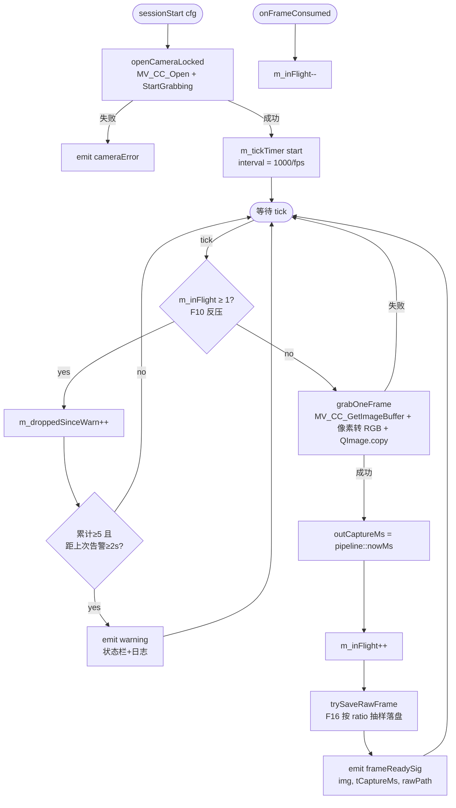

**代码逻辑图**:

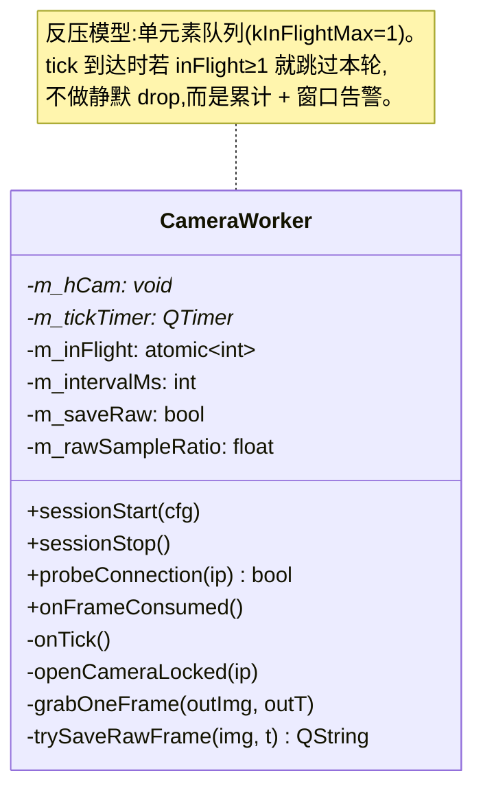

**关键字段(`RuntimeConfig`)**:`cameraIp`, `cameraHwFps`, `softFps`, `saveRaw`, `rawSampleRatio`, `saveDir`。

### 3.2 `YoloWorker` + `YoloSession` + `postprocess_ex`

**定位**:RKNN 推理 + YOLOv8-Seg 后处理 + 可视化 overlay。

- 映射需求:F8(模型常驻)、F11(过滤与字段)、F5(可视化)、F16 #3(结果图落盘)。
- 文件:
  - `src/pipeline/yolo_worker.{h,cpp}` —— Qt Worker 壳
  - `src/pipeline/yolo_session.{h,cpp}` —— RKNN C API 封装(纯 C++,无 Qt)
  - `src/pipeline/postprocess_ex.{h,cpp}` —— 置信度过滤 + 按类 NMS + Mask 计算
  - `src/pipeline/postprocess.h` —— `SegObject` 数据结构

**业务逻辑图**:

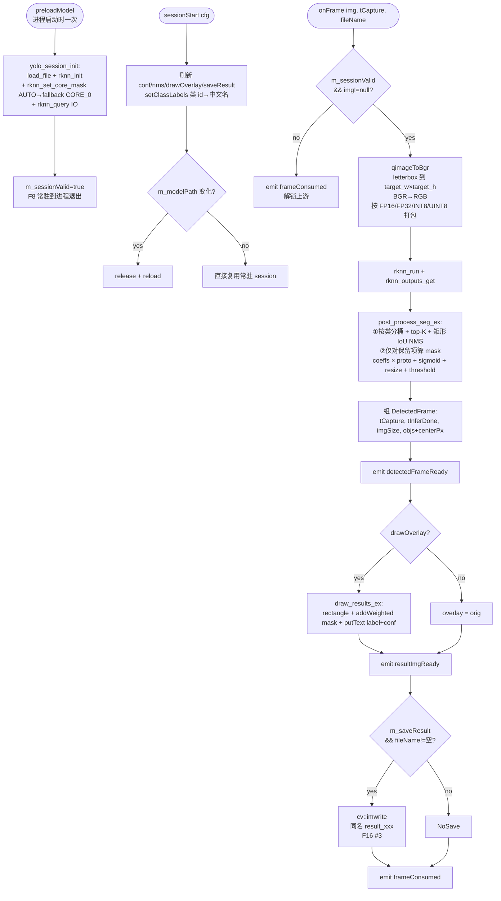

**`postprocess_ex` 两阶段优化(对齐 master)**:

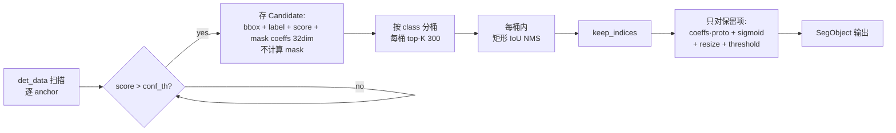

**代码逻辑图**:

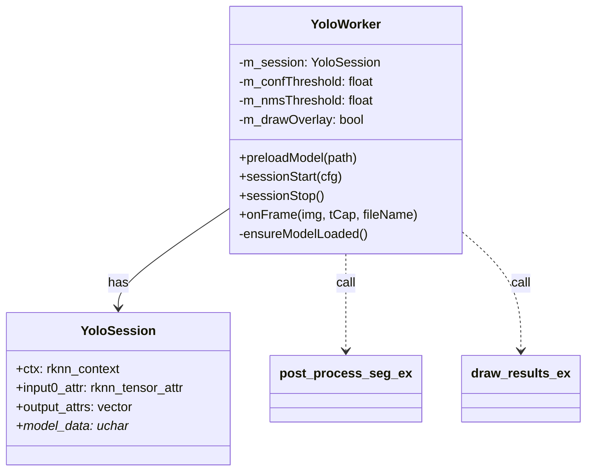

**与设计文档的差异**:

- 设计 §3.3 说"visualizeReady"信号,代码落地名为 `resultImgReady`,语义一致。
- 设计 §3.3 的 `droppedBusy` 信号未实现;反压改由 CameraWorker 内部 `m_inFlight` 计数 + 窗口告警解决(位置前移、更简单)。

### 3.3 `TrackerWorker`

**定位**:把逐帧检测结果转换到 belt 系,跨帧 mask-IoU 关联,触发 `SortTask`。

- 映射需求:F12、F13。
- 文件:`src/pipeline/tracker_worker.{h,cpp}`。

**业务逻辑图**:

```mermaid
flowchart TD
    FI([onFrameInferred frame]) --> Chk{sessionActive?}
    Chk -- no --> Drop1[丢弃]
    Chk -- yes --> First{m_firstFrame?}
    First -- yes --> Ghostify[F4/AC15:<br/>首帧所有 det<br/>转 DispatchedGhost 送已分拣池<br/>不入 active]
    Ghostify --> Done1([return])
    First -- no --> Raster[rasterizeToBelt 每个 det:<br/>像素→mm→栅格<br/>mask resize 到栅格图<br/>mmPerPx=2]

    Raster --> Cand[建候选集:<br/>每个 det × active track<br/>把 trk bbox 按 speed × t-tCapture 外推到 tNow<br/>算 maskIoU]
    Cand --> Greedy[AssocCandidate 按 iou desc 排序<br/>detUsed / trkUsed 标记位<br/>贪心匹配 F13 贪心策略]
    Greedy --> Merge[匹配命中:<br/>trk_now 与 det 做 mask union 融合<br/>trk.mask/bbox←merged<br/>trk.tCaptureMs=tNow<br/>updateCount++<br/>classAreaAcc += area]

    Merge --> New[未匹配 det 先查已分拣池:<br/>若与任一 ghost IoU≥阈值<br/>→ 该 det 与 ghost 做 union 融合并刷新时间戳<br/>不新建 track(F13 已派发抑制)<br/>否则新建 TrackedObject<br/>trackId++]
    New --> Miss[未匹配 trk:<br/>missCount++<br/>注意用 trkUsed.size 做边界<br/>不踩新 push 的]
    Miss --> Trig{条件 A/B:<br/>miss≥X 或 upd≥Y?}
    Trig -- no --> Purge
    Trig -- yes --> Class[选 classAreaAcc 最大类<br/>bestClass]
    Class --> Filter{bestClass 在<br/>enabledClassIds?}
    Filter -- no --> RmSilent[remove from active<br/>不触发 SortTask]
    Filter -- yes --> EmitST[emit sortTaskReady<br/>+ push 到 m_ghosts<br/>+ remove from active]
    RmSilent --> Purge
    EmitST --> Purge
    Purge[purgeGhosts:<br/>ghost 的 trailing edge 外推到 tNow<br/>越过 dispatchLineYb + pool_clear<br/>则丢弃]
```

**代码逻辑图**:

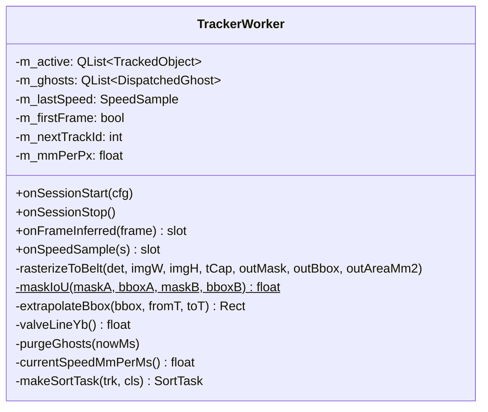

**关键算法要点**(防回归):

- `rasterizeToBelt` 只做"像素 → 相机视野内物理 mm → 栅格";**不**叠加 belt 位移。位移统一由 `extrapolateBbox` 单点加,避免"双位移"(历史 bug B1)。
- `trkUsed` 循环边界用 `trkUsed.size()` 而非 `m_active.size()`,因为未匹配 det 会先 push 到 `m_active`,尾部新 track 不能再算 miss(历史 bug B2)。
- `purgeGhosts` 里分拣线按 `sorterMode` 取 valve 或 arm;判定用 `yb_trail`(trailing edge)越过分拣线 + `dispatchedPoolClearMm`。

### 3.4 `Dispatcher`

**定位**:把 `SortTask` 转换成 `ValvePulse` 时间轴,或 stub 到机械臂(日志 + CSV)。

- 映射需求:F14.1、F14.2、F14.2 中的速度重算。
- 文件:`src/pipeline/dispatcher.{h,cpp}`。

**业务逻辑图**:

```mermaid
flowchart TD
    ST([onSortTask task]) --> Act{sessionActive?}
    Act -- no --> Drop1
    Act -- yes --> Mode{sorterMode?}
    Mode -- Arm --> Arm[dispatchArmStub:<br/>bbox 重心→armA/B 本地 xy<br/>写 CSV + emit armStubDispatched]
    Mode -- Valve --> Compute[computePulses task, speed]
    Compute --> PulseChk{empty?}
    PulseChk -- yes --> Warn[emit warning<br/>不入 pending<br/>不派发]
    PulseChk -- no --> Enq[m_pending insert trackId→task<br/>emit enqueuePulses]

    SS([onSpeedSample s]) --> Save[m_lastSpeed = s]
    Save --> Delta{|Δ|/old ><br/>speed_recalc_pct?}
    Delta -- no --> Ret
    Delta -- yes --> Loop[遍历 m_pending:<br/>① emit cancelPulses<br/>② 以新 speed recompute<br/>③ 空→从 pending 删除<br/>   非空→ emit enqueuePulses]
```

**F14.2 喷阀预计算主算法**(`computePulses`):

```mermaid
flowchart TD
    I[输入 SortTask + speed] --> G1[bbox_yb_max = y+h = 前沿<br/>bbox_yb_min = y = 后沿]
    G1 --> G2{后沿 dy_tail < 0?}
    G2 -- yes --> Rtn0[return 空<br/>已全部越过喷阀线]
    G2 -- no --> G3[t_head = tCap + dy_head/speed<br/>t_tail = tCap + dy_tail/speed]
    G3 --> G4[头部留白:<br/>从 mask 最后一行 前沿侧 向后累积<br/>直到非零像素≥totalArea × headSkipRatio]
    G4 --> G5[row_open_start → yb_open<br/>→ t_open_start]
    G5 --> Roll[滚动投影<br/>t 从 t_open_start 步长 openDurMs:<br/>① 计算 "喷阀线对应物体 mask 哪一行"<br/>② 该行非零列→xb→chanIdx→boardId/bitPos<br/>③ 构造 ValvePulse]
    Roll --> Merge[min_cmd_interval_ms 合并:<br/>同 board 上一条 pulse 距离过近<br/>→ 位图 OR、tClose 取大]
    Merge --> R[返回 QVector~ValvePulse~]
```

**代码逻辑图**:

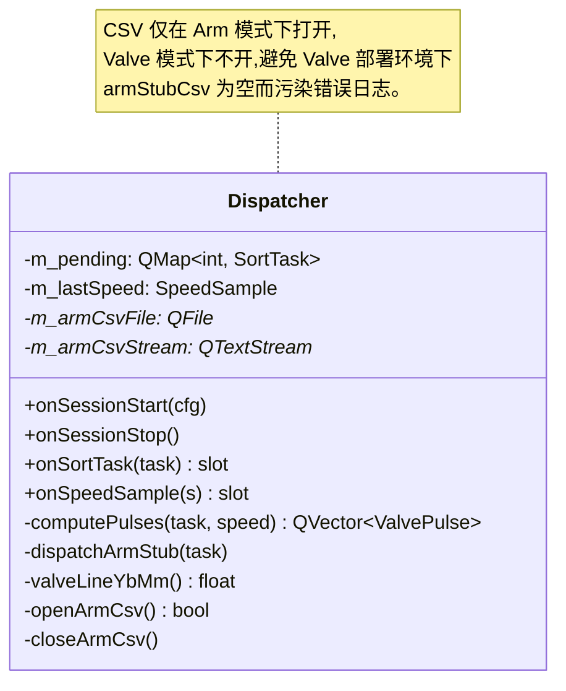

**设计边界**:

- 只发 `enqueuePulses` / `cancelPulses`,绝不自己写串口。执行节奏交给 `boardControl` 的 5 ms tick。
- 速度重算只做"整体取消 + 重算",不做 per-pulse 差分,简化 1 个数量级。

### 3.5 `boardControl`(BoardWorker)

**定位**:RS485 串口单一总线,完成两件事:

1. **500 ms 周期**问编码器 → 解析 → 发 `SpeedSample`。
2. **5 ms 周期** tick,把 `m_pending` 里 `tOpenMs ≤ now` 的 pulse 真正下发开/关阀帧。

- 映射需求:F12 速度来源、F14.2 阀控执行。
- 文件:`src/pipeline/boardcontrol.{h,cpp}`。

**业务逻辑图**:

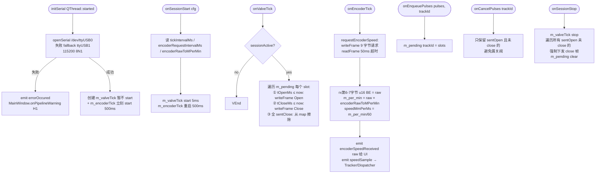

**协议(来自 `design.md §6.1`)**:

| 帧类型 | 字节布局 | 说明 |
|---|---|---|
| 批量开阀 | `AA 55 · 11 06 02 · b6(板) b7(cnt) b8(ch高) b9(ch低) · chk · 55 AA` | b7 = bit_count(b8)+bit_count(b9) |
| 批量关阀 | 同上,b7=0x09,b8=b9=0x00 | 关该板所有通道 |
| 编码器请求 | `AA 55 · 11 03 03 · 0A 21 · 55 AA` | 9 字节 |
| 编码器响应 | `AA 55 · 11 05 03 · 0A rawH rawL ...` | 11 字节 |

**代码逻辑图**:

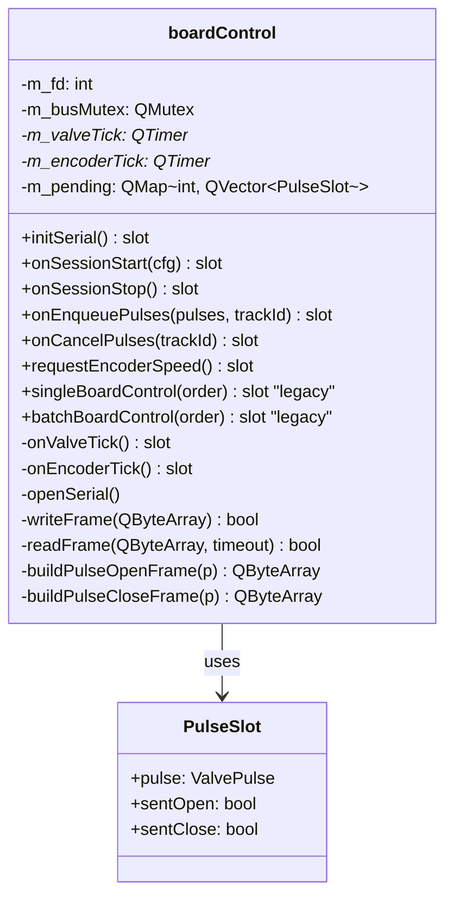

**并发 / 时序保证**:

- `m_busMutex` 仅保护 `writeFrame` 内的 write + tcdrain(单帧粒度)。
- `QTimer` 在 `m_boardThread` 的事件循环上串行触发,`onValveTick` 和 `onEncoderTick` 天然不会重入。
- `sessionStop` 先 `stop()` valveTick 再 force-close,保证 stop 后硬件不会遗留长开阀。

### 3.6 数据类型 `pipeline_types.h`

所有跨线程信号的参数 POD,`Q_DECLARE_METATYPE` + `main.cpp::qRegisterMetaType`。

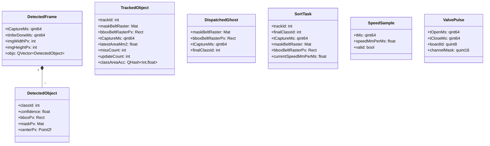

**不变量**:所有 `tCaptureMs` 字段都来自 `pipeline::nowMs()`,同一条物体全链路沿用同一个 `tCaptureMs`,禁止任何消费者重新赋值。

### 3.7 时钟 `pipeline_clock`

```mermaid
flowchart LR
    A[main.cpp<br/>pipeline::initClock] --> B[g_timer = QElapsedTimer<br/>g_timer.start]
    B --> C[所有 worker 取时间<br/>= pipeline::nowMs<br/>= g_timer.msecsSinceReference]
    C --> D[跨 worker 比较<br/>都基于同一起点<br/>单调递增 ms]
```

---

## 4. 配置层 `src/config`

**`RuntimeConfig`** 是一个 POD 结构,分组覆盖:

| 分组 | 字段(摘) | 使用方 |
|---|---|---|
| camera | `cameraIp`, `cameraHwFps`, `realLengthMm`, `realWidthMm` | CameraWorker, TrackerWorker |
| model & yolo | `modelPath`, `modelInputSize`, `confThreshold`, `nmsThreshold`, `classButtons`, `drawOverlay` | YoloWorker |
| pipeline | `softFps`, `iouThreshold`, `missFramesX`, `updateFramesY`, `dispatchedPoolClearMm`, `maskRasterMmPerPx`, `tickIntervalMs` | Camera/Tracker/Board |
| belt | `nominalSpeedMs`, `encoderRawToMPerMin`, `encoderRequestIntervalMs` | BoardWorker, Tracker/Dispatcher 兜底 |
| sorter | `sorterMode` (Valve/Arm), `armDistanceMm`, `valveDistanceMm` | TrackerWorker, Dispatcher |
| valve | `valveTotalChannels`, `valveBoards`, `valveChannelsPerBoard`, `valveXMinMm/XMaxMm`, `valveHeadSkipRatio`, `valveOpenDurationMs`, `valveMinCmdIntervalMs`, `valveSpeedRecalcPct` | Dispatcher |
| arm_stub | 8 个标定参 `armA/B.originX/Y/xSign/ySign` | Dispatcher |
| persistence | `saveRaw`, `rawSampleRatio`, `saveResult`, `saveDir`, `armStubCsv` | CameraWorker / YoloWorker / Dispatcher |
| runtime | `enabledClassIds` (由 UI 勾选合成) | TrackerWorker |

**加载流程**:

```mermaid
flowchart LR
    A[MainWindow 构造] --> B[loadRuntimeConfig config.ini]
    B --> C[QSettings begin/endGroup 读各组]
    C --> D[填 RuntimeConfig 结构]
    D --> E[m_cfg 保存在 MainWindow]
    E --> F[refreshEnabledClassIdsFromUi<br/>补 enabledClassIds]
    F --> G[sessionStart Queued Q_ARG RuntimeConfig<br/>值拷贝下发到 5 个 worker]
    G --> H[worker 本地持有副本<br/>运行中不再回读文件]
```

**编码器 raw 语义**(和 master 分支口径一致):raw 是板卡内部采样好的"瞬时转速代理",直接 `raw × encoderRawToMPerMin = m/min`,**不是累计脉冲也不是窗口增量**,无需差分或除以采样窗口。数值巧合 `m/s == mm/ms`。

---

## 5. 基础设施 `src/infra`

- `logger.{h,cpp}`:轻量日志宏 `LOG_INFO / LOG_ERROR`,底层同步写文件 + stderr。所有 worker 共用。
- `pipeline_clock.{h,cpp}`:全局 `QElapsedTimer`,单调时钟源;`initClock()` 在 `main.cpp` 最早调用一次。

```mermaid
flowchart LR
    main --> initClock --> pipeline::nowMs
    subgraph 全量调用者
        CW -.-> pipeline::nowMs
        YW -.-> pipeline::nowMs
        TW -.-> pipeline::nowMs
        DP -.-> pipeline::nowMs
        BW -.-> pipeline::nowMs
    end
```

---

## 6. 遗留模块 `src/legacy`

以下代码当前保留不在主链路,留给后续阶段:

| 文件 | 作用 | 状态 |
|---|---|---|
| `robotcontrol.{h,cpp}` | HR Robot SDK 调用壳 | 仅为未来对接 stub 保留 |
| `tcpforrobot.{h,cpp}` | TCP server,原本给机械臂 | 保留,不在 SortTask 链路 |
| `savelocalpic.{h,cpp}` | 旧本地保存逻辑 | 由 CameraWorker::trySaveRawFrame + YoloWorker 落盘取代 |
| `uploadpictooss.{h,cpp}` | 阿里云 OSS 上传 | 保留,不纳入关键路径 |
| `updatemanager.{h,cpp}` | 更新检查 | 启动时一次性调用 |

`MainWindow` 仍然实例化这些模块,但连线弱化,不会影响 Running 态的主业务。

---

## 7. 端到端时序(典型一帧)

把一颗物体从"进入视野"到"喷阀打中"画成一张图。假设:

- fps=2,tickIntervalMs=5,openDurationMs=50
- 相机视野纵向 realWidthMm=470mm
- 喷阀距视野最近边缘 valveDistanceMm=800mm
- 皮带速度 0.5 m/s = 0.5 mm/ms

```mermaid
sequenceDiagram
    autonumber
    participant HW as 皮带/相机/阀
    participant CW as CameraWorker
    participant YW as YoloWorker
    participant TW as TrackerWorker
    participant DP as Dispatcher
    participant BW as BoardWorker

    rect rgb(230,245,255)
    Note over HW,BW: 阶段 A:采图 + 推理(~200ms/帧)
    HW->>CW: MV_CC_GetImageBuffer (frame)
    CW->>CW: t_capture = pipeline::nowMs
    CW->>CW: 抽样落盘 raw (F16)
    CW->>YW: frameReadySig(img, t_capture, file)
    YW->>YW: letterbox + rknn_run + post_process_seg_ex
    YW->>YW: overlay 绘制
    YW->>TW: detectedFrameReady (DetectedFrame)
    YW->>CW: frameConsumed (解锁反压)
    end

    rect rgb(255,245,225)
    Note over TW: 阶段 B:跨帧追踪 (~1ms)
    TW->>TW: rasterizeToBelt (每个 det 转栅格)
    TW->>TW: extrapolateBbox 所有 active 到 tNow
    TW->>TW: 贪心 IoU 关联 → 合并 / 新增 / miss
    alt miss≥X 或 upd≥Y 且 bestClass ∈ enabledClassIds
        TW->>DP: sortTaskReady (SortTask)
        TW->>TW: 把 trk 转 ghost push 到 m_ghosts
    end
    TW->>TW: purgeGhosts
    end

    rect rgb(240,255,230)
    Note over DP,BW: 阶段 C:阀序列预计算(~1ms)
    DP->>DP: computePulses(task, speed)
    Note right of DP: 算 t_head/t_tail<br/>+ 头部留白 row_open_start<br/>+ 滚动投影按 openDurMs 步进<br/>+ min_cmd_interval_ms 合并
    DP->>BW: enqueuePulses(QVector<ValvePulse>, trackId)
    BW->>BW: m_pending[trackId] = slots
    end

    rect rgb(255,235,235)
    Note over BW,HW: 阶段 D:阀硬件执行(每 5ms tick)
    loop 每 5ms onValveTick
        BW->>BW: for slot: tOpenMs ≤ now → writeFrame Open
        BW->>HW: AA 55 11 06 02 ... 55 AA (开)
        BW->>BW: tCloseMs ≤ now → writeFrame Close
        BW->>HW: AA 55 11 06 02 ... b7=0x09 ... 55 AA (关)
    end
    end

    rect rgb(245,240,255)
    Note over BW,TW: 阶段 E:速度监测 + 重算(每 500ms)
    BW->>HW: writeFrame 请求帧 (9 字节)
    HW-->>BW: 响应帧 (11 字节)
    BW->>TW: speedSample (Qt Queued)
    BW->>DP: speedSample
    alt |Δspeed|/old > speed_recalc_pct
        DP->>BW: cancelPulses(trackId)
        DP->>DP: recompute pulses with new speed
        DP->>BW: enqueuePulses(new pulses)
    end
    end
```

---

## 8. 需求-设计-代码对照表

| 需求编号 | 需求点 | 设计章节 | 代码落地 |
|---|---|---|---|
| F1 | 分拣器选择(valve/arm) | §1 模块图 + §3.6 | `RuntimeConfig::sorterMode`;`Dispatcher::onSortTask` 按 mode 分流 |
| F2 | 皮带速度/fps/距离配置 | §5 配置 schema | `RuntimeConfig` 各字段;`config.ini` [pipeline][sorter] |
| F3 | 品类按钮 → `enabledClassIds` | §5 | `MainWindow::refreshEnabledClassIdsFromUi`;`TrackerWorker` 过滤 |
| F4 | 启停、第一帧丢弃、硬停 | §1.3 Session | `startSession/stopSession`;`TrackerWorker::m_firstFrame` |
| F5 | 可视化 box+mask+label,空检测清屏 | §3.3 | `YoloWorker::resultImgReady` + `draw_results_ex` |
| F6 | 告警同时进日志 + 状态栏 | §7.1 | `MainWindow::onPipelineWarning` 汇聚 |
| F8 | 模型常驻 | §3.3 | `YoloWorker::preloadModel` / `ensureModelLoaded` |
| F9 | 采图 + 节流 + t_capture | §3.2 | `CameraWorker::onTick` + `pipeline::nowMs` |
| F10 | 单元素反压 + 告警 | §3.2 | `CameraWorker::m_inFlight` + 窗口告警 |
| F11 | conf/nms 参数化 + 每目标字段 | §3.3 + §4 | `post_process_seg_ex` + `DetectedFrame/DetectedObject` |
| F12 | 像素→belt 系,`t_now - t_capture` 补偿 | §4.1 | `TrackerWorker::rasterizeToBelt` + `extrapolateBbox` |
| F13 | 跨帧追踪、贪心、抑制池 | §4.3 | `TrackerWorker::onFrameInferred` |
| F14.1 | Arm stub 日志 + CSV | §4.5 + §7.2 | `Dispatcher::dispatchArmStub` + arm_stub.csv |
| F14.2 | 阀预计算 + 速度重算 | §4.4 | `Dispatcher::computePulses` + `onSpeedSample` |
| F15 | 统一 `config.ini` | §5 | `loadRuntimeConfig` + `RuntimeConfig` |
| F16 | 保存原图/结果图 | §3.2 + §3.3 | `CameraWorker::trySaveRawFrame` + `YoloWorker::onFrame` 落盘 |

---

## 文档状态

- **版本**:v1.0
- **对齐**:`requirements.md` v1.1 + `design.md` v1.0 + 当前 `src/` 实现
- **变更历史**:此为第一版,与代码同步时间点为结构重组 commit `7e04ca8` 之后。
